# 06 圖表總覽

> 本頁所有圖以 Mermaid 撰寫，在 HTML 版與 GitHub 上都會自動渲染成圖。
> **每張圖下方都附有圖例，請先看圖例再看圖。**

---

## 1. 產品心智圖

回答：「這個產品到底有哪些東西？」

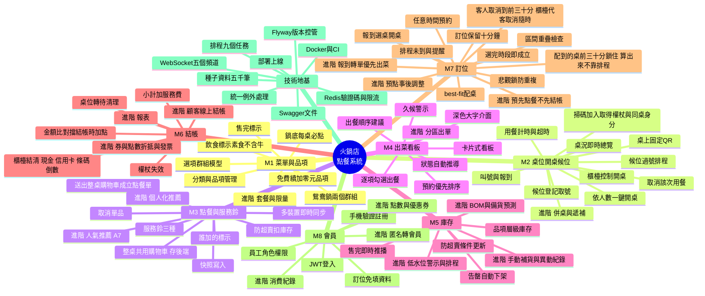

**圖例**

| 標記 | 意義 |
|---|---|
| M1～M8 | 八大模組，**全部在基礎層** |
| 「進階 …」 | 該模組的延伸細項，基礎全綠燈後才動工 |
| 技術地基 | 不是功能，但沒有它五個人會互相踩 |

---

## 2. 基礎與進階分層圖

回答：「什麼一定要做？什麼是加分的？」

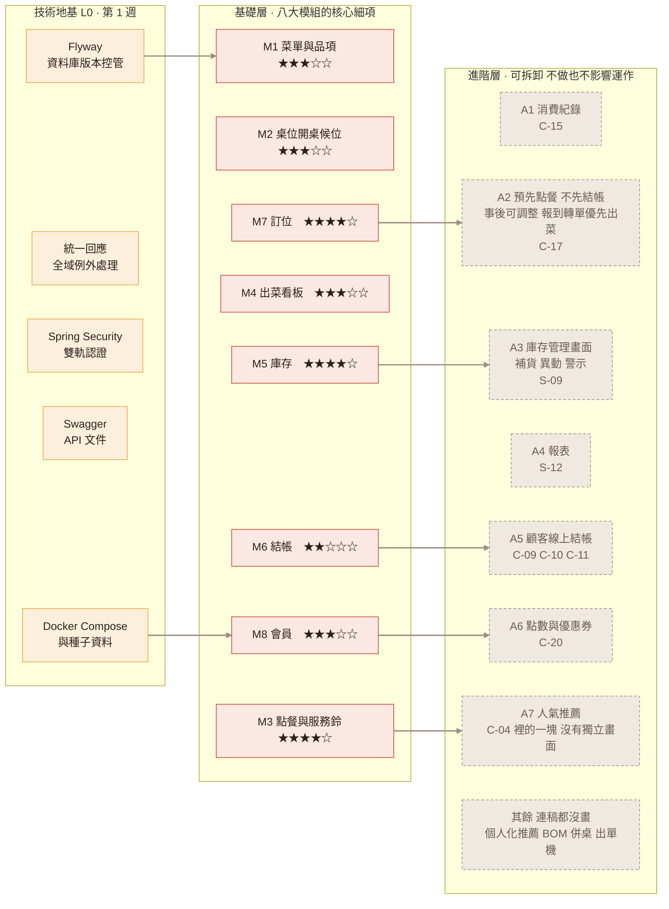

**圖例**

| 樣式 | 意義 |
|---|---|
| 黃色 | 技術地基——不是功能，但缺了五個人會互相踩 |
| 紅色 | **基礎層**：拿掉它，這套系統就沒辦法讓一家店做生意 |
| 灰色虛線 | **進階層**：拿掉它系統還能運作，只是比較笨。A1～A7 已經畫了設計稿（A1～A6 共 8 張畫面；A7 人氣推薦只是 C-04 裡的一塊），時間夠就照稿做；「其餘」那一格連稿都沒畫 |
| ★ | 難易度，見 [00-架構分層](00-架構分層與技術選型.md) §2.4 |

**推進方式是廣度優先**：八個模組先各做最薄一層、串成一條營運閉環，再回頭加厚。**不是**做完 M1 才做 M2。

---

## 3. 系統工程架構圖

回答：「東西跑在哪裡、彼此怎麼講話？」由左到右分五層。

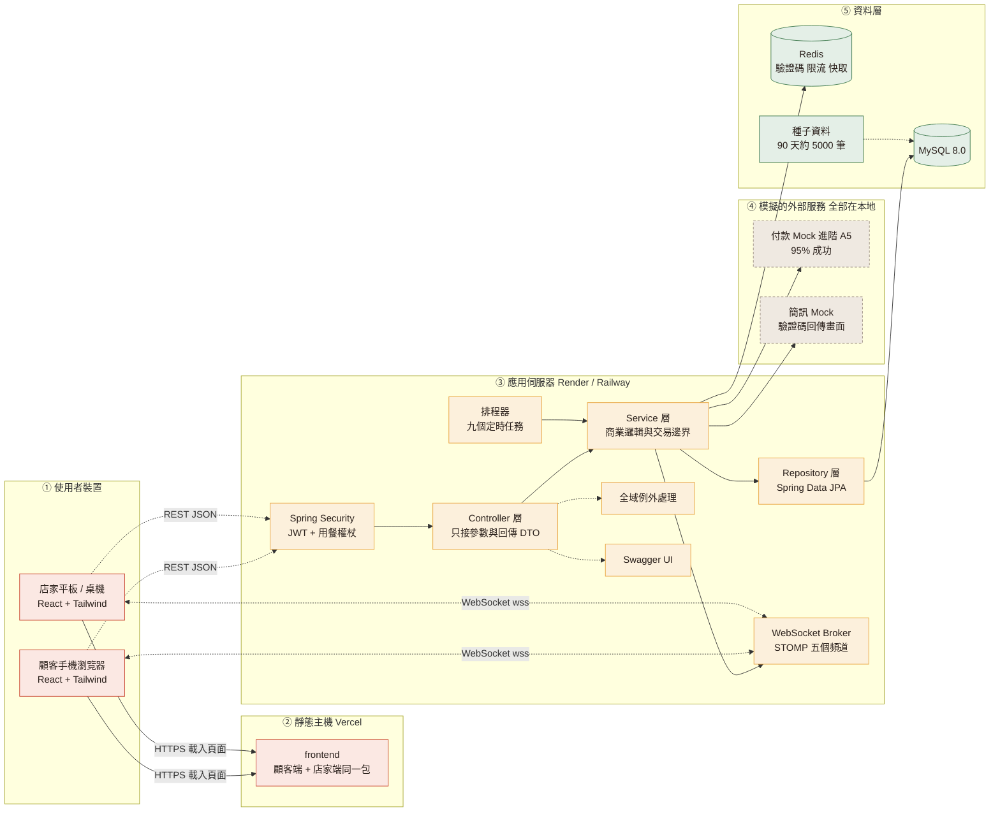

**圖例**

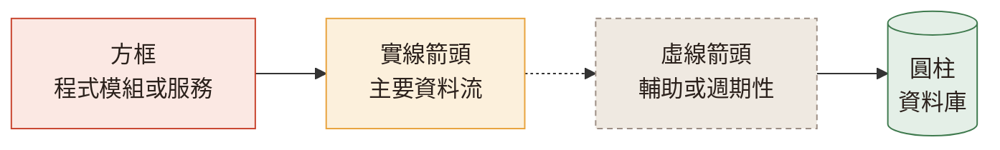

| 顏色 | 代表 |
|---|---|
| 淺紅 | 前端（React） |
| 淺黃 | 後端（Spring Boot） |
| 淺綠 | 資料層（MySQL、Redis） |
| 灰底虛線 | 模擬的外部服務，**不串接真實 API** |

**三個關鍵設計決定**

1. **前端拆成兩個獨立專案**，顧客端與店家端互不影響
2. **雙向的 WebSocket 連線**是即時性的來源，REST 負責初次載入與寫入
3. **付款與簡訊全是本地 Mock**，不需要任何外部帳號或正式網域

---

## 4. 建議時程甘特圖

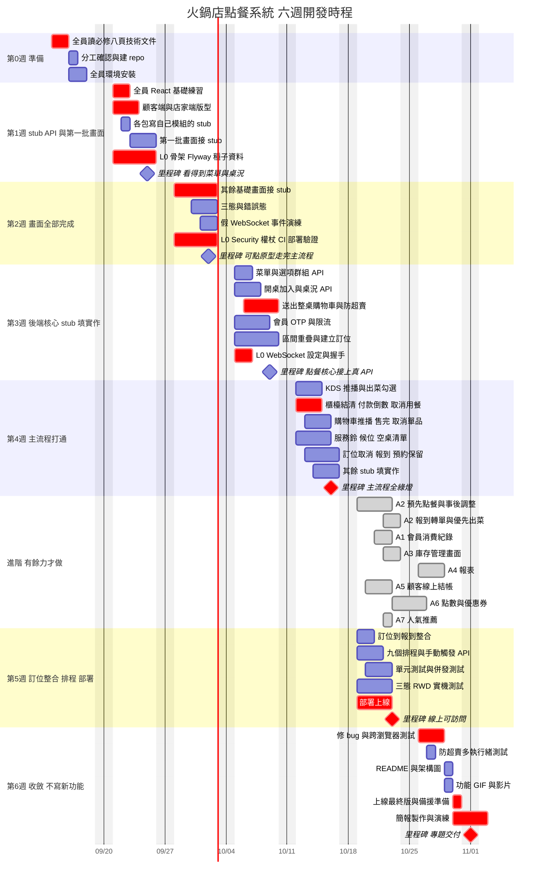

**圖例**

| 樣式 | 意義 |
|---|---|
| **紅色粗體長條** | 關鍵路徑，延遲會直接拖累整個專案 |
| 一般長條 | 可平行進行 |
| ◆ 菱形 | 里程碑，當天要能實際演示 |
| 空白 | 已排除週末 |

**六個絕對不能延誤的點**

> 前端一律接真的 API：各包先出 stub、再填實作，見 [05 §1.4.4](05-開發流程與分工.md)。

1. **9/20 前**：全員讀完必修八頁、認領工作包
2. **9/25**：前端跑得起來，打後端 stub 看得到菜單與桌況
3. **10/02**：35 張基礎畫面完成，可點原型走完主流程
4. **10/16**：主流程全綠燈（真的 API＋WebSocket 同步）← **最重要**
5. **10/23**：線上 demo 可訪問
6. **10/26 起**：一行新功能都不寫

---

## 5. UML 類別圖（領域模型）

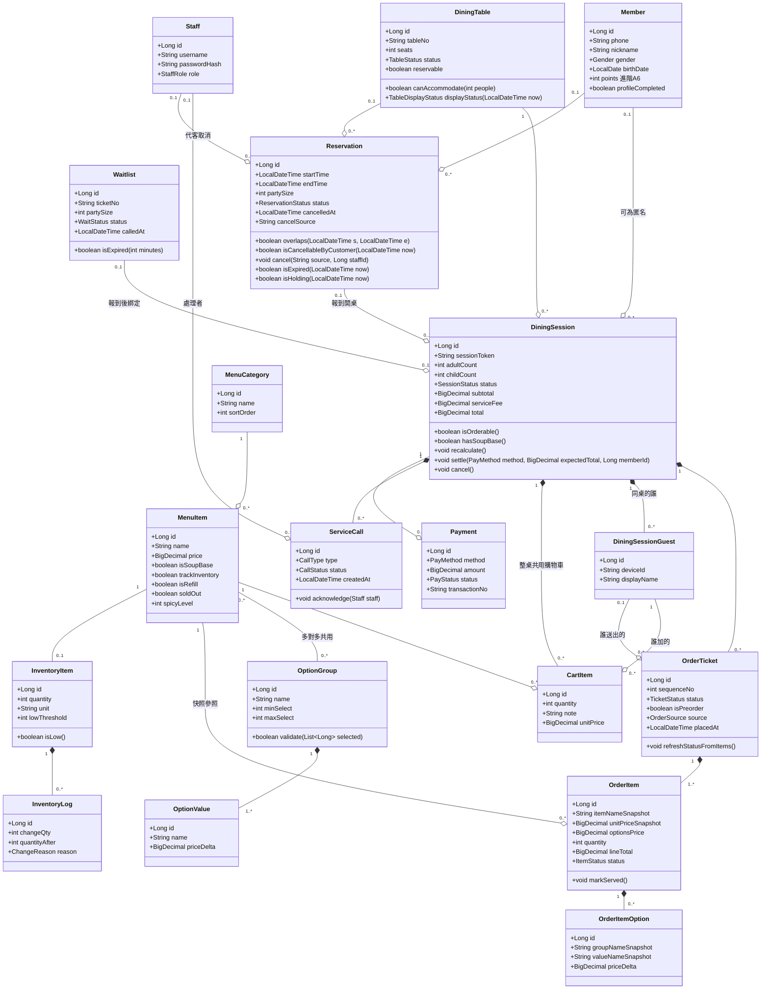

**圖例：UML 關係符號**

| 符號 | 名稱 | 意義 | 例子 |
|---|---|---|---|
| `*──` 實心菱形 | 組合 Composition | 強擁有，父刪子也消失 | `DiningSession *-- OrderTicket` |
| `o──` 空心菱形 | 聚合 Aggregation | 弱擁有，子可獨立存在 | `MenuCategory o-- MenuItem` |
| `──` 實線 | 關聯 Association | 一般關係 | `MenuItem -- OptionGroup` |
| `1` `0..1` `0..*` `1..*` | 多重性 | 兩端各有幾個 | `1 *-- 1..*` |
| `+` | public | | |
| `List~Long~` | 泛型 | 等同 `List<Long>` | |

**五個要看懂的重點**

1. **`DiningSession → OrderTicket → OrderItem` 是三層組合**，對應「一次用餐 → 多張點餐單 → 多個品項」。這是整個系統的骨幹。
2. **`MenuItem` 與 `OptionGroup` 是多對多**，「辣度」建立一次可掛在 20 個品項上。鴛鴦鍋也是靠這個機制（掛兩個群組）表達，**不需要「鍋位」類別**。
3. **`OrderItem` 存快照**（`itemNameSnapshot` / `unitPriceSnapshot`），改菜單價格不影響歷史帳單。
4. **`ServiceCall` 和 `Waitlist` 是新增的兩個類別**，分別支撐服務鈴與現場候位。
5. **`CartItem` 掛在 `DiningSession` 底下、整桌共用**；`DiningSessionGuest` 只記「誰」（裝置 UUID＋顯示名稱），不是身分驗證。
   `DiningTable.displayStatus()` 與 `Reservation.isHolding()` 是**算出來的**，沒有對應的欄位。
   `Reservation.isCancellableByCustomer(now)` 只給客人線上取消用（`now ≤ startTime − 30 分`）；櫃檯代客取消 `cancel("STAFF", staffId)` 不看期限，只看狀態是不是 `CONFIRMED`。

---

## 6. UML 狀態圖

### 6.1 用餐紀錄 DiningSession

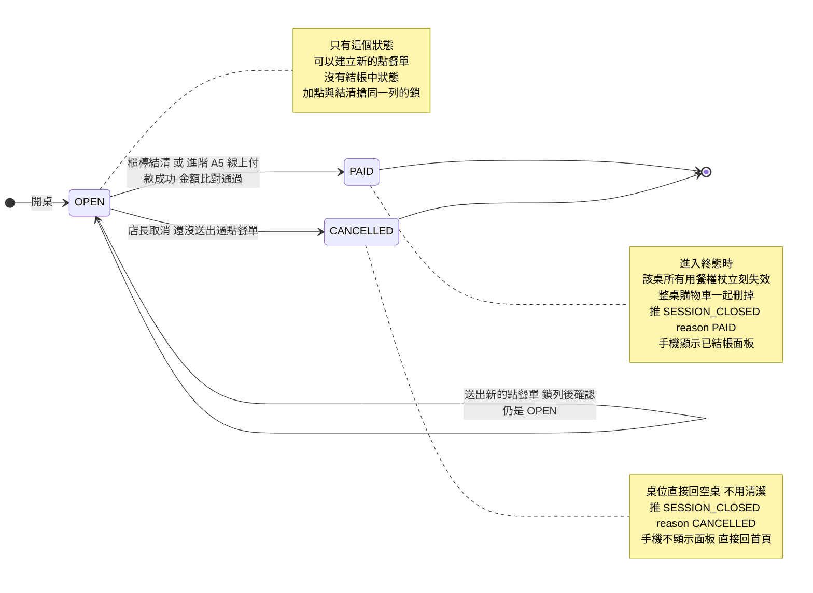

> **沒有 `CHECKOUT_PENDING`。** 舊版「要求結帳 → 鎖定 → 可取消」那一段整個拿掉了，基礎是客人到櫃檯結帳。
> 「結帳時剛好有人加點」改用金額比對：結清／付款帶 `expectedTotal`，重算不相等回 `409 BILL_CHANGED`，
> 狀態留在 `OPEN`，刷新後再按一次；已經不是 `OPEN` 回 `409 SESSION_CLOSED`。A5 付款失敗一樣留在 `OPEN`。
>
> **取消該次用餐**只給沒點過餐的桌（送出過點餐單回 `409 SESSION_HAS_ORDERS`「已經有點餐紀錄，請改用結帳」）。

### 6.2 點餐單 OrderTicket

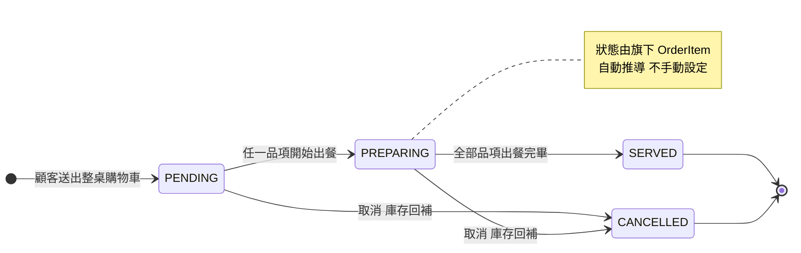

### 6.3 桌位 DiningTable

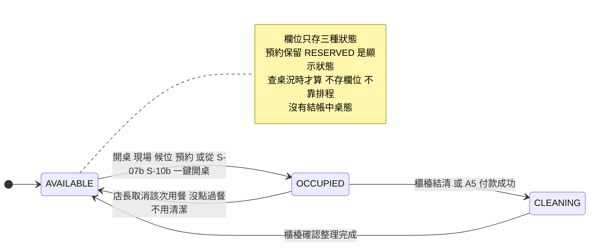

> **三種狀態、四個轉移**：空桌可以開、用餐中可以結帳（→ 待清理）或在沒點過餐時取消（→ 直接回空桌）、待清理可以按完成。
> 欄位裡只有這三種；**訂位會在時間窗內鎖住配到的桌，但那是查詢時算出來的顯示狀態**（見下面 6.3b），候位不鎖桌。
> 另一個接點照舊——**開桌成功時，把來源那筆訂位或候位轉成已報到**。
>
> 舊版的 `RESERVED` 是存在桌位欄位裡、由排程在訂位前 30 分鐘自動轉入，等於把 `reservation`
> 複製一份到桌位上、還要靠 cron 同步，已經移除。現在的 `RESERVED` 每次現算，不存、不靠排程。
> **只有訂位會鎖桌，候位不鎖桌**：叫號只是通知，客人到櫃檯才選桌開桌；沒有「櫃檯自己把空桌鎖起來」這個功能。

### 6.3b 桌況的顯示狀態（算出來的，不是欄位）

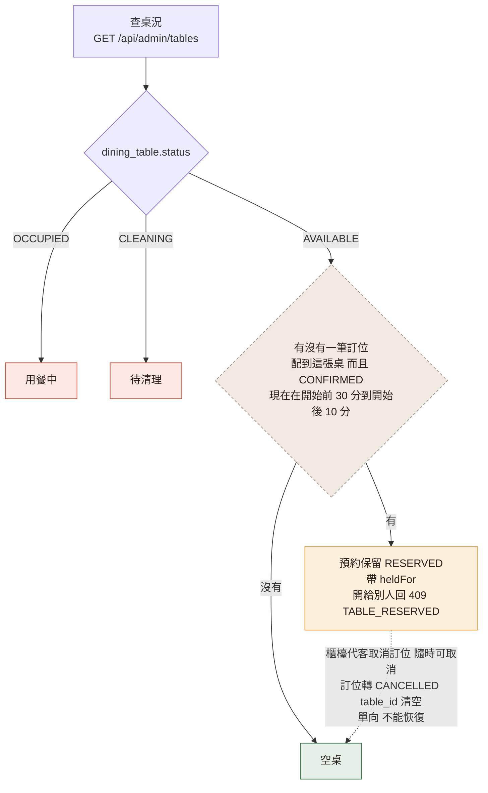

| 樣式 | 意義 |
|---|---|
| 灰底虛線菱形 | 每次查詢當場判斷，**不寫回資料庫** |
| 淺黃 | 預約保留（桌況上的暖黃色塊，格內「18:30 陳○君 4 位」） |
| 虛線箭頭 | 要解開保留就是**取消那筆訂位**（櫃檯代客取消，M7 7.18）：訂位轉 `CANCELLED`、`table_id` 設 NULL，下次查詢直接走「沒有」那條；**隨時可取消**（不受期限）；**單向**，沒有恢復的路。沒有「只解除保留、訂位照留」這種操作 |

> 判斷順序就是顯示優先順序：**用餐中 ＞ 待清理 ＞ 預約保留 ＞ 空桌**。配到的桌到時間還在用餐中，就不顯示保留，客人到了從 S-07b 選別張桌。
> 30、10 兩個數字在 `application.yml`（`reservation.hold-before-minutes`、`reservation.hold-after-minutes`）。
>
> 圖上沒畫的「開桌強烈提醒」不是顯示狀態：空桌在「現在 ～ 現在 + 115 分」內有別筆訂位要開始，桌格照樣是空桌，只有進開桌頁或選桌清單時才顯示醒目警示、要按「仍要開桌」再確認（只提醒不擋）。

### 6.4 訂位 Reservation

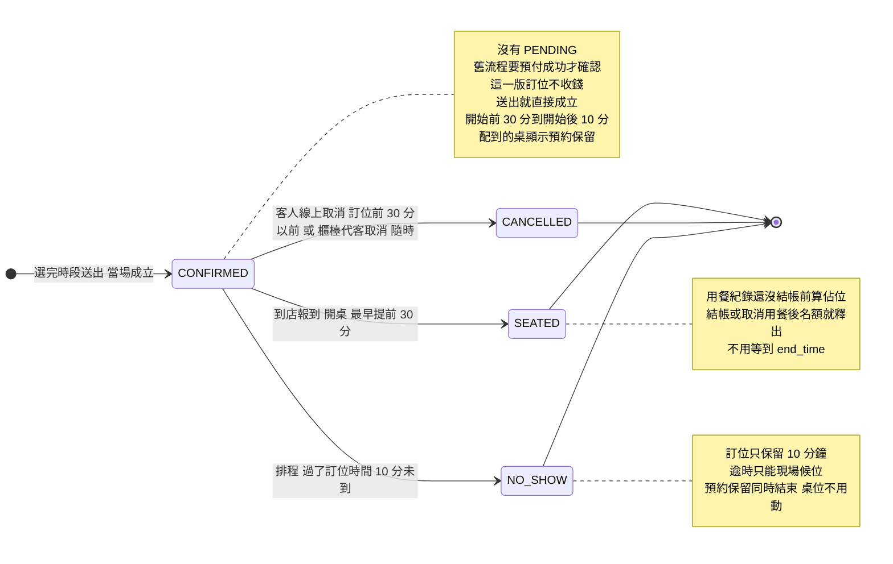

> **訂位保留 10 分鐘，最早提前 30 分鐘報到。** 排程每 5 分鐘才跑一次，所以開桌頁的預約清單只列現在 −10～+30 分的，
> 報到 API 也自己檢查：太早回 `409 RESERVATION_TOO_EARLY`，逾時回 `409 RESERVATION_EXPIRED`，不等排程。
>
> 取消會把 `table_id` 設為 `NULL`，釋放 `UNIQUE(table_id, start_time)`，那個時段才能重新被訂走。
> `NO_SHOW` 發生時那個時段已經開始了，不需要釋放，`table_id` 留著當紀錄（跟 [03](03-資料庫設計.md) 一致）；
> 它本來就不算佔位（區間重疊只看 `CONFIRMED` 與還沒結帳的 `SEATED`），預約保留也在訂位時間後 10 分鐘自己結束，桌位狀態完全不受影響。
>
> **`SEATED` 只在用餐紀錄還沒結帳（`dining_session.status = OPEN`）時算佔用**：客人還坐著就要算；結帳或取消用餐後名額立刻釋出，不用等到 `end_time`。
> 線上訂位只能訂明天以後，所以這條主要影響的是「同一天之後的訂位保留」與容量報表的正確性，不會出現當天被線上搶訂的情況。
>
> **取消有兩個入口**：客人線上取消只到訂位時間前 30 分鐘（之後回 `409 CANCEL_DEADLINE_PASSED`），剛好是預約保留開始的時間；
> 櫃檯代客取消隨時可以（`POST /api/admin/reservations/{id}/cancel`）。兩者都只能取消 `CONFIRMED` 的（其他回 `409 RESERVATION_NOT_CANCELLABLE`），
> 都把 `table_id` 設 NULL，並用 `cancel_source`（`CUSTOMER`／`STAFF`）記是誰取消的。沒有「只解除保留」這條轉移。

### 6.4b 預先點餐（進階）

這不是資料庫欄位，是由「有沒有內容」加上「現在幾點」推導出來的。

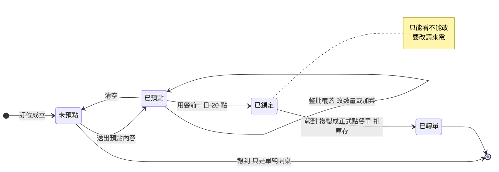

> **「已鎖定」的時間點（前一日 20 點）跟取消訂位的期限（訂位前 30 分）是兩條線**，預點鎖定之後客人仍然可以取消訂位。
> 預點截止維持前一天 20:00（2026-09-16 定案）。
>
> **「已鎖定 → 已轉單」才扣庫存。** 預點階段完全不碰庫存，
> 所以到店可能有品項已售完，報到 API 會回一份 `soldOut` 清單給櫃檯。
> 取捨的理由見 [M7 問題 7](modules/M7-訂位.md)。

### 6.5 候位 Waitlist

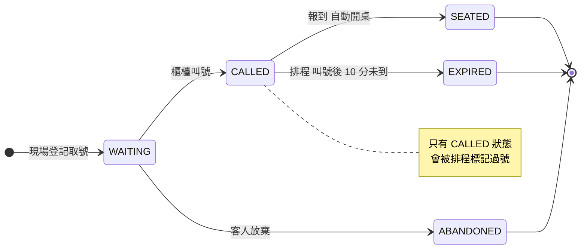

**圖例**

| 符號 | 意義 |
|---|---|
| `[*] -->` | 起始狀態 |
| `--> [*]` | 終止狀態，不可再轉移 |
| 箭頭上的文字 | 觸發轉移的事件或條件 |
| 「排程」開頭的轉移 | 由定時任務自動觸發，**不是人為操作** |
| 自己指向自己 | 狀態不變但有動作發生 |

---

## 7. 資料庫 ER 圖

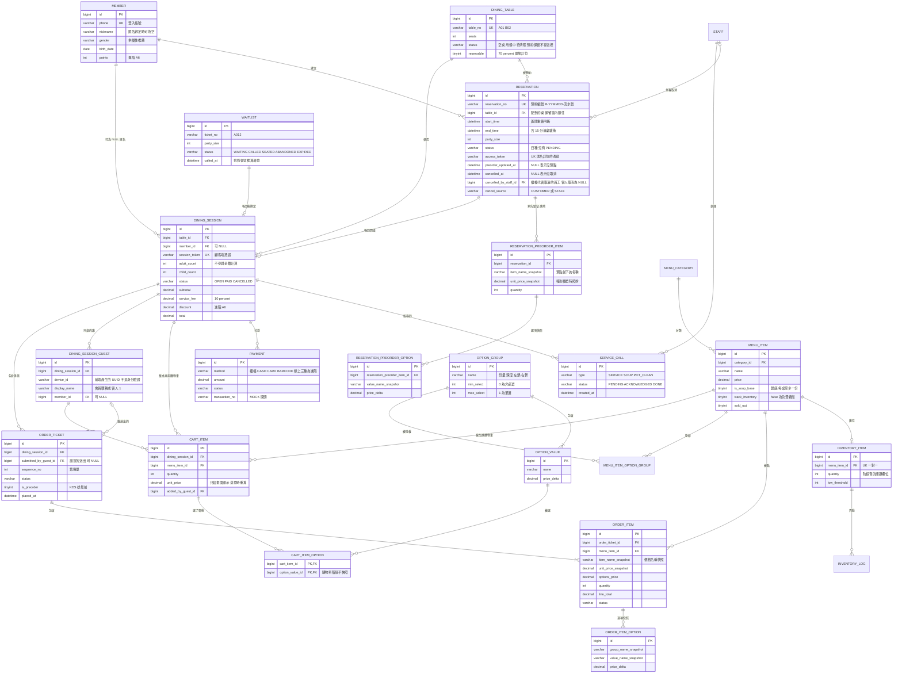

**圖例：ER 關係符號（烏鴉腳記法）**

| 符號 | 意義 |
|---|---|
| `\|\|` | 恰好一個 |
| `o\|` | 零或一個 |
| `\|{` | 一個或多個 |
| `o{` | 零或多個 |
| PK / FK / UK | 主鍵／外鍵／唯一鍵 |

讀法範例：`ORDER_TICKET ||--|{ ORDER_ITEM` 讀作「**一張**點餐單包含**一個以上**的單品」。

**關鍵約束**

```sql
-- 防重複訂位（資料庫層的保險）
CREATE UNIQUE INDEX uk_reservation_table_start ON reservation (table_id, start_time);

-- 區間重疊檢查用
CREATE INDEX idx_reservation_table_time ON reservation (table_id, start_time, end_time);

-- 匿名訂位的存取憑證（沒有 JWT 的客人靠它回來改自己的單）
CREATE UNIQUE INDEX uk_reservation_access_token ON reservation (access_token);

-- 同一支手機在同一桌只有一個身分
CREATE UNIQUE INDEX uk_guest_session_device ON dining_session_guest (dining_session_id, device_id);
```

---

## 8. 主流程時序圖

### 8.1 店內用餐：掃碼 → 共用購物車 → 點餐 → 出菜 → 櫃檯結帳

**這就是 demo 當天要演的那條路。**

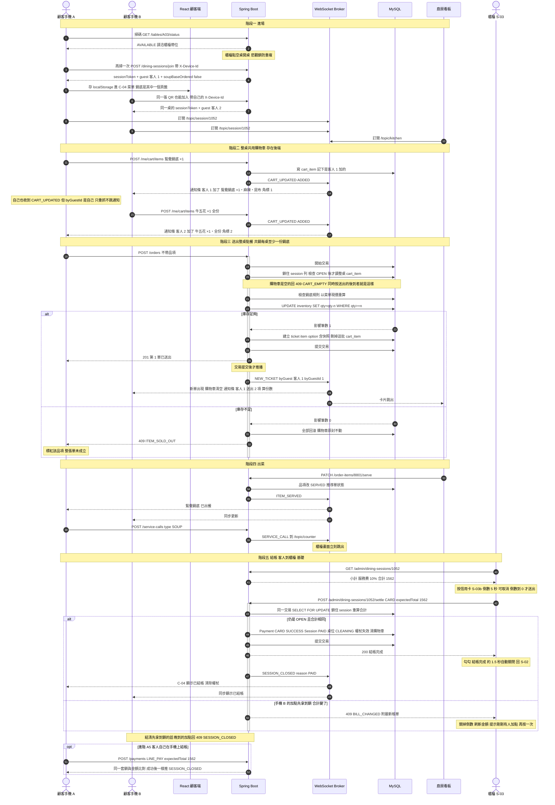

**圖例**

| 符號 | 意義 |
|---|---|
| 實線箭頭 `->>` | 發出請求 |
| 虛線箭頭 `-->>` | 回傳結果或推播 |
| `alt / else` | 分支：兩種可能的結果 |
| 灰色垂直長條 | 該參與者正在處理中（交易進行中） |
| `Note` | 補充說明 |

**這張圖的六個重點**

1. **掃碼第一次被擋下來**——桌位還是 `AVAILABLE`，櫃檯沒開桌。這是「半輔助工具」定位的具體呈現。
2. **購物車是整桌共用、存在後端的（第 11～17 步）。** 兩支手機各加各的，加進同一份；每次異動推 `CART_UPDATED`，
   另一支跳通知條「客人 1 加了 鴛鴦鍋底 ×1・麻辣・昆布」（事件帶 `optionSummary`）；事件帶 `byGuestId`，自己的動作只重抓、不跳通知。
   角標與「送出 N 項」都算**份數**（`totalQuantity`、`NEW_TICKET` 的 `quantity`），不是列數。`X-Device-Id` 只拿來標示誰加的，不是身分驗證。
3. **第 18～32 步是整個系統最重要的交易**。送出不帶品項，**鎖住 session 之後**才讀整桌購物車（第 20 步）；
   扣庫存用 `WHERE qty >= n` 判斷影響筆數，任一項失敗整張單回滾、購物車原封不動；成功就在同一個交易裡刪掉購物車（第 24 步）。
   兩個人同時按送出，後到的拿到空購物車 → `409 CART_EMPTY`。
4. **推播一律在交易提交之後**，否則前端收到通知去查卻查不到資料。
5. **手機 B 不輪詢**，所有更新都是推過去的；收到 `CART_UPDATED` 或 `NEW_TICKET` 就重抓購物車（以後端為準），連上時和斷線重連時也各要抓一次完整資料。
6. **結帳在櫃檯（第 40～50 步），沒有「結帳中」狀態。** 櫃檯按付款方式（現金／信用卡／條碼都一樣）後先倒數 5 秒（S-03b，可取消），倒數到 0 才送出，成功後約 1.5 秒自動關閉；還沒送出的購物車品項在結清時直接捨棄（櫃檯畫面不提示）；
   結清帶 `expectedTotal`，跟送出點餐（第 20 步）搶同一把列鎖：
   加點先到，結清拿到 `BILL_CHANGED`；結清先到，加點拿到 `SESSION_CLOSED`。成功推 `SESSION_CLOSED`（`reason: PAID`）。客人手機上的「我要結帳」是進階 A5。

---

### 8.2 訂位與預先點餐：成立 → 補點 → 報到轉單

虛線框住的是**進階**（M7 的 7.E1～7.E3）。只做基礎的話，這張圖就是「查時段 → 訂位成立 → 報到開桌」三段。

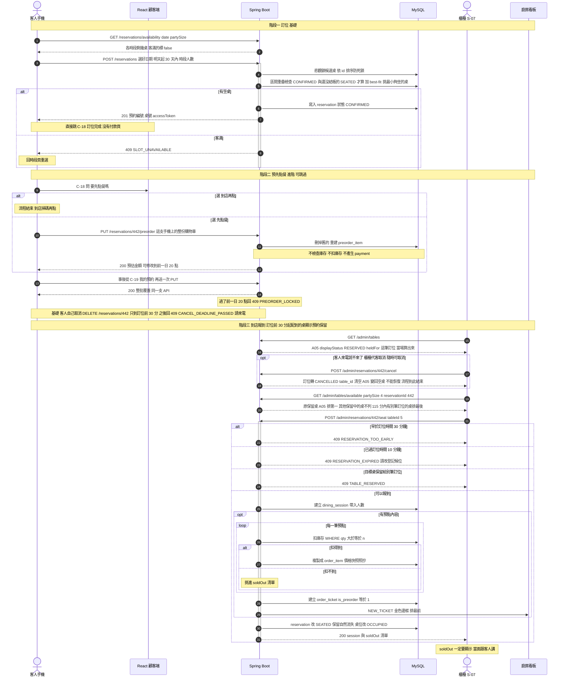

**圖例**

| 符號 | 意義 |
|---|---|
| 實線箭頭 `->>` | 發出請求 |
| 虛線箭頭 `-->>` | 回傳結果或推播 |
| `alt / else` | 分支：兩種可能的結果 |
| `opt` | 可選：條件成立才發生 |
| `loop` | 重複執行 |
| `Note` | 補充說明 |

**這張圖的五個重點**

1. **第 7 步就結束了訂位。** 沒有付款、沒有等待確認，`201` 回來訂位就成立。
   舊流程要走完「選時段 → 先點餐 → 付款」三步才算訂到位，那是把訂位綁在金流上；
   拆開之後，客人少一道門檻，我們也少一整條退款分支要寫。
2. **預點是同一支 `PUT` 整批覆蓋**（第 10 步與第 13 步）。「先點餐」和「事後調整」在後端是同一件事，
   前端也是同一個畫面（C-17），只差有沒有帶入現有內容。
3. **庫存到第 26 步才扣**。預點不鎖庫存，代價是到店可能售完 → `soldOut` 清單。
   這是設計選擇不是 bug，要在驗收時講得出來。
4. **配到的桌在訂位前 30 分鐘起顯示「預約保留」（第 15～16 步）**，是查桌況時當場算的，沒有排程。
   要解開保留就是取消訂位：客人來電時櫃檯代客取消（第 17～18 步），**隨時可取消**，訂位轉 `CANCELLED`、桌子與名額一起釋出，單向不能恢復（不是 `CONFIRMED` 回 `RESERVATION_NOT_CANCELLABLE`）；
   客人自己線上取消只到訂位前 30 分（圖中第 14 步後面的註記），之後回 `CANCEL_DEADLINE_PASSED`。
5. **報到前先選桌（第 19～21 步）**。S-07b 列出坐得下的空桌，原保留桌排第一，別人的保留桌不列，115 分鐘內有別筆訂位的桌標紅字、排最後（選了要按「仍要開桌」再確認）；
   太早回 `RESERVATION_TOO_EARLY`、過了訂位時間 10 分鐘回 `RESERVATION_EXPIRED`、開到別人的保留桌回 `TABLE_RESERVED`（第 22～24 步），
   都不等排程。報到成功後這筆轉 `SEATED`，保留條件不成立，保留自己消失（第 30 步）。
