# 06 圖表總覽

> 本頁所有圖以 Mermaid 撰寫，在 HTML 版與 GitHub 上都會自動渲染成圖。
> **每張圖下方都附有圖例，請先看圖例再看圖。**

---

## 1. 產品心智圖

回答：「這個產品到底有哪些東西？」

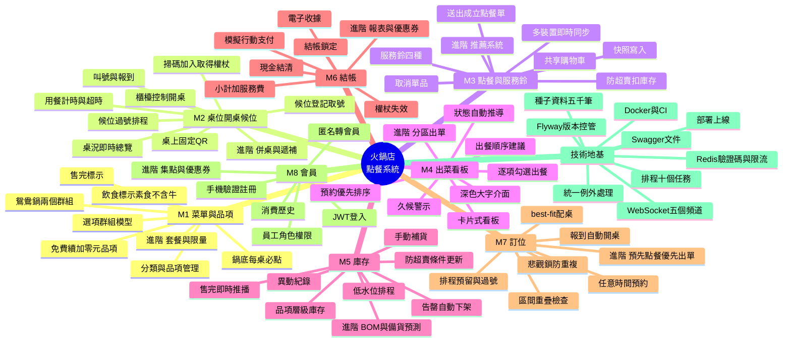

**圖例**

| 標記 | 意義 |
|---|---|
| M1～M8 | 八大模組，**全部在基礎層** |
| 「進階 …」 | 該模組的延伸細項，基礎全綠燈後才動工 |
| 技術地基 | 不是功能，但沒有它五個人會互相踩 |

---

## 2. 基礎與進階分層圖

回答：「什麼一定要做？什麼是加分的？」

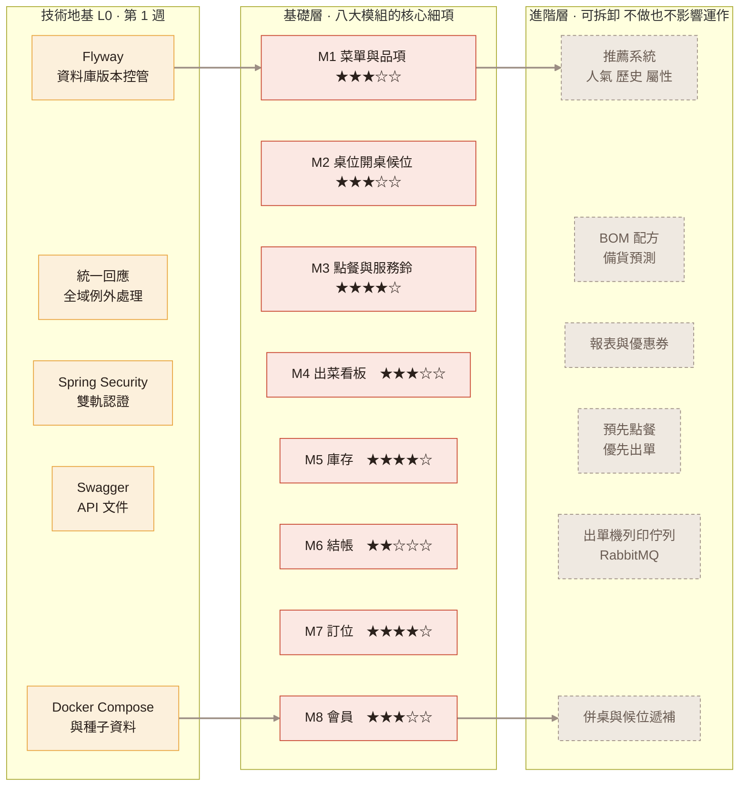

**圖例**

| 樣式 | 意義 |
|---|---|
| 黃色 | 技術地基——不是功能，但缺了五個人會互相踩 |
| 紅色 | **基礎層**：拿掉它，這套系統就沒辦法讓一家店做生意 |
| 灰色虛線 | **進階層**：拿掉它系統還能運作，只是比較笨 |
| ★ | 難易度，見 [00-架構分層](00-架構分層與技術選型.md) §2.4 |

**推進方式是廣度優先**：八個模組先各做最薄一層、串成一條營運閉環，再回頭加厚。**不是**做完 M1 才做 M2。

---

## 3. 系統工程架構圖

回答：「東西跑在哪裡、彼此怎麼講話？」由左到右分五層。

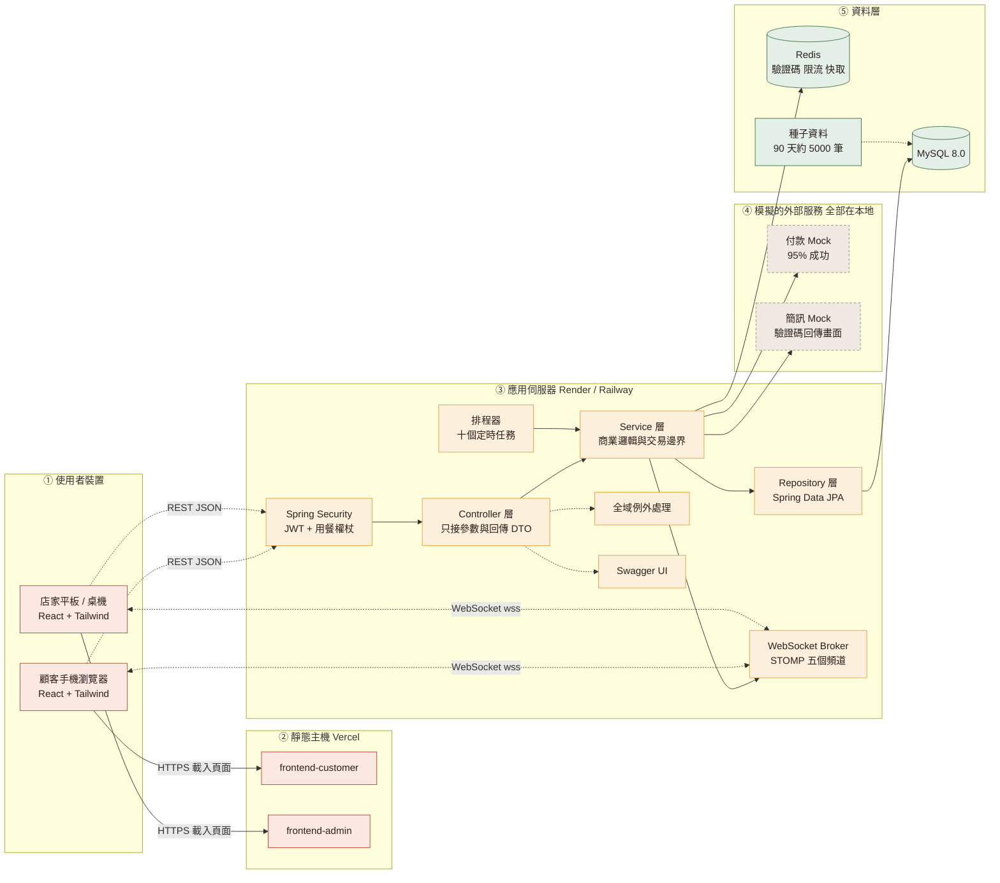

**圖例**

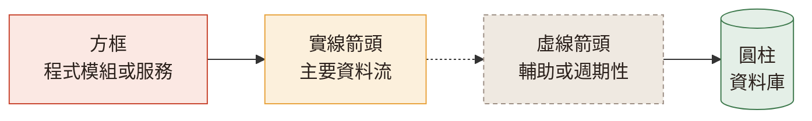

| 顏色 | 代表 |
|---|---|
| 淺紅 | 前端（React） |
| 淺黃 | 後端（Spring Boot） |
| 淺綠 | 資料層（MySQL、Redis） |
| 灰底虛線 | 模擬的外部服務，**不串接真實 API** |

**三個關鍵設計決定**

1. **前端拆成兩個獨立專案**，顧客端與店家端互不影響
2. **雙向的 WebSocket 連線**是即時性的來源，REST 負責初次載入與寫入
3. **付款與簡訊全是本地 Mock**，不需要任何外部帳號或正式網域

---

## 4. 建議時程甘特圖

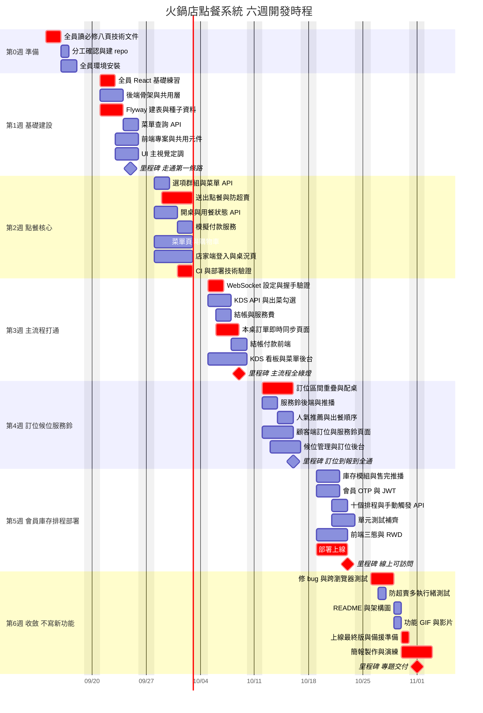

**圖例**

| 樣式 | 意義 |
|---|---|
| **紅色粗體長條** | 關鍵路徑，延遲會直接拖累整個專案 |
| 一般長條 | 可平行進行 |
| ◆ 菱形 | 里程碑，當天要能實際演示 |
| 空白 | 已排除週末 |

**五個絕對不能延誤的點**

1. **9/20 前**：全員讀完必修八頁、分工確認
2. **9/25**：walking skeleton 打通
3. **10/09**：主流程全綠燈（含 WebSocket 同步）← **最重要**
4. **10/23**：線上 demo 可訪問
5. **10/26 起**：一行新功能都不寫

---

## 5. UML 類別圖（領域模型）

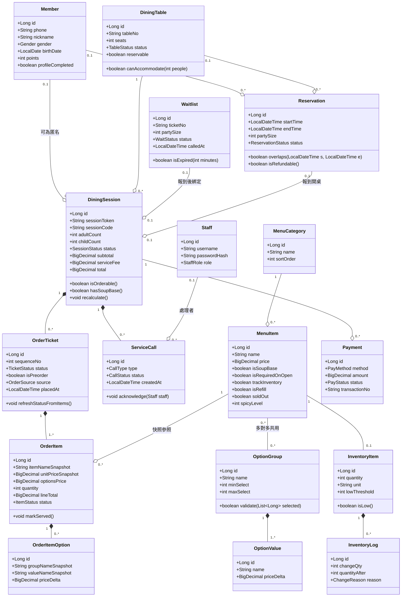

**圖例：UML 關係符號**

| 符號 | 名稱 | 意義 | 例子 |
|---|---|---|---|
| `*──` 實心菱形 | 組合 Composition | 強擁有，父刪子也消失 | `DiningSession *-- OrderTicket` |
| `o──` 空心菱形 | 聚合 Aggregation | 弱擁有，子可獨立存在 | `MenuCategory o-- MenuItem` |
| `──` 實線 | 關聯 Association | 一般關係 | `MenuItem -- OptionGroup` |
| `1` `0..1` `0..*` `1..*` | 多重性 | 兩端各有幾個 | `1 *-- 1..*` |
| `+` | public | | |
| `List~Long~` | 泛型 | 等同 `List<Long>` | |

**四個要看懂的重點**

1. **`DiningSession → OrderTicket → OrderItem` 是三層組合**，對應「一次用餐 → 多張點餐單 → 多個品項」。這是整個系統的骨幹。
2. **`MenuItem` 與 `OptionGroup` 是多對多**，「辣度」建立一次可掛在 20 個品項上。鴛鴦鍋也是靠這個機制（掛兩個群組）表達，**不需要「鍋位」類別**。
3. **`OrderItem` 存快照**（`itemNameSnapshot` / `unitPriceSnapshot`），改菜單價格不影響歷史帳單。
4. **`ServiceCall` 和 `Waitlist` 是新增的兩個類別**，分別支撐服務鈴與現場候位。

---

## 6. UML 狀態圖

### 6.1 用餐紀錄 DiningSession

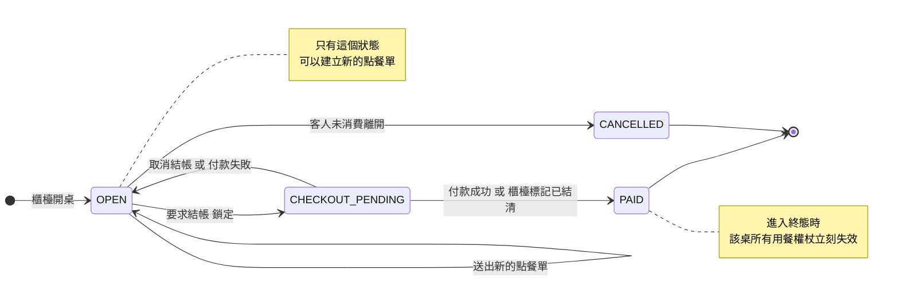

### 6.2 點餐單 OrderTicket

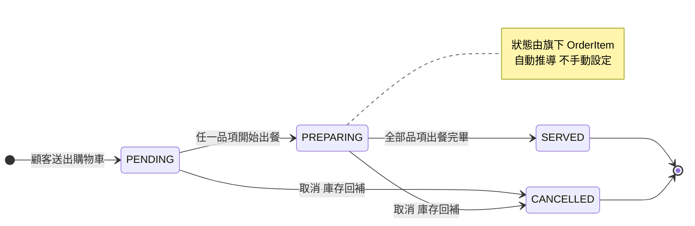

### 6.3 桌位 DiningTable

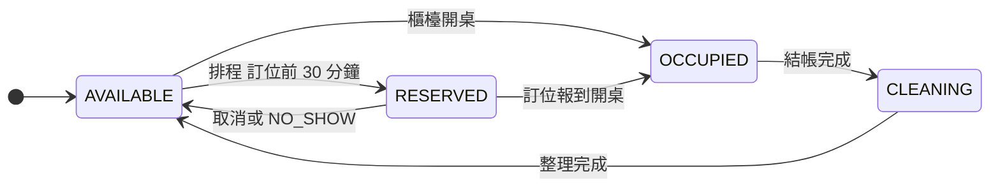

### 6.4 訂位 Reservation

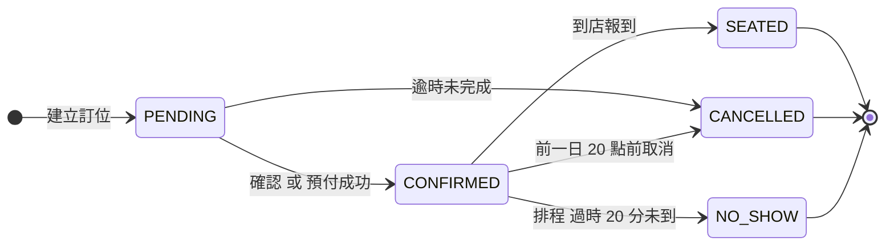

### 6.5 候位 Waitlist

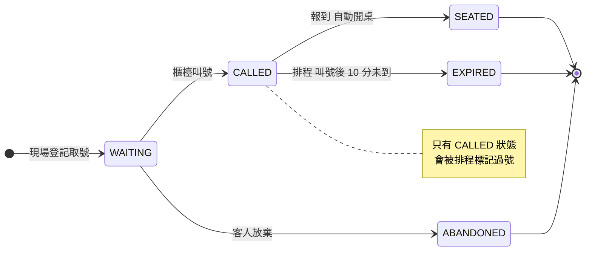

**圖例**

| 符號 | 意義 |
|---|---|
| `[*] -->` | 起始狀態 |
| `--> [*]` | 終止狀態，不可再轉移 |
| 箭頭上的文字 | 觸發轉移的事件或條件 |
| 「排程」開頭的轉移 | 由定時任務自動觸發，**不是人為操作** |
| 自己指向自己 | 狀態不變但有動作發生 |

---

## 7. 資料庫 ER 圖

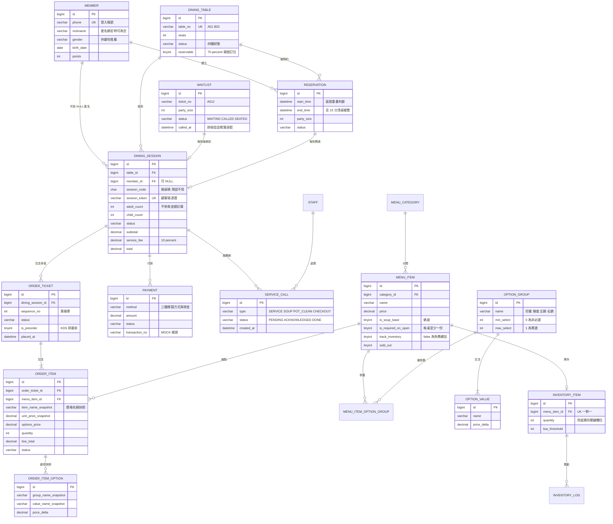

**圖例：ER 關係符號（烏鴉腳記法）**

| 符號 | 意義 |
|---|---|
| `\|\|` | 恰好一個 |
| `o\|` | 零或一個 |
| `\|{` | 一個或多個 |
| `o{` | 零或多個 |
| PK / FK / UK | 主鍵／外鍵／唯一鍵 |

讀法範例：`ORDER_TICKET ||--|{ ORDER_ITEM` 讀作「**一張**點餐單包含**一個以上**的單品」。

**兩個關鍵約束**

```sql
-- 防重複訂位（資料庫層的保險）
CREATE UNIQUE INDEX uk_reservation_table_start ON reservation (table_id, start_time);

-- 區間重疊檢查用
CREATE INDEX idx_reservation_table_time ON reservation (table_id, start_time, end_time);
```

---

## 8. 主流程時序圖

「掃碼 → 點餐 → 出菜 → 結帳」的完整互動。**這就是 demo 當天要演的那條路。**

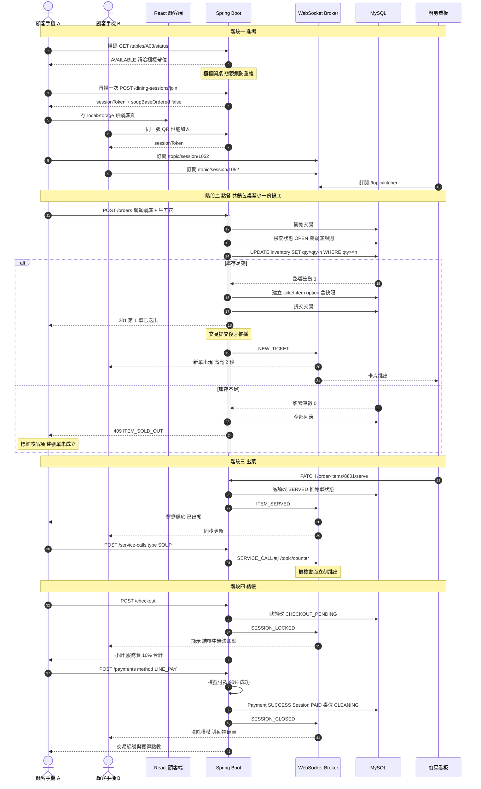

**圖例**

| 符號 | 意義 |
|---|---|
| 實線箭頭 `->>` | 發出請求 |
| 虛線箭頭 `-->>` | 回傳結果或推播 |
| `alt / else` | 分支：兩種可能的結果 |
| 灰色垂直長條 | 該參與者正在處理中（交易進行中） |
| `Note` | 補充說明 |

**這張圖的四個重點**

1. **掃碼第一次被擋下來**——桌位還是 `AVAILABLE`，櫃檯沒開桌。這是「半輔助工具」定位的具體呈現。
2. **第 12～23 步是整個系統最重要的交易**。扣庫存用 `WHERE qty >= n` 判斷影響筆數，任一項失敗整張單回滾。
3. **推播一律在交易提交之後**，否則前端收到通知去查卻查不到資料。
4. **手機 B 全程沒有發過一次查詢請求**，所有更新都是推過去的。但它連上時和斷線重連時，各要抓一次完整資料。
