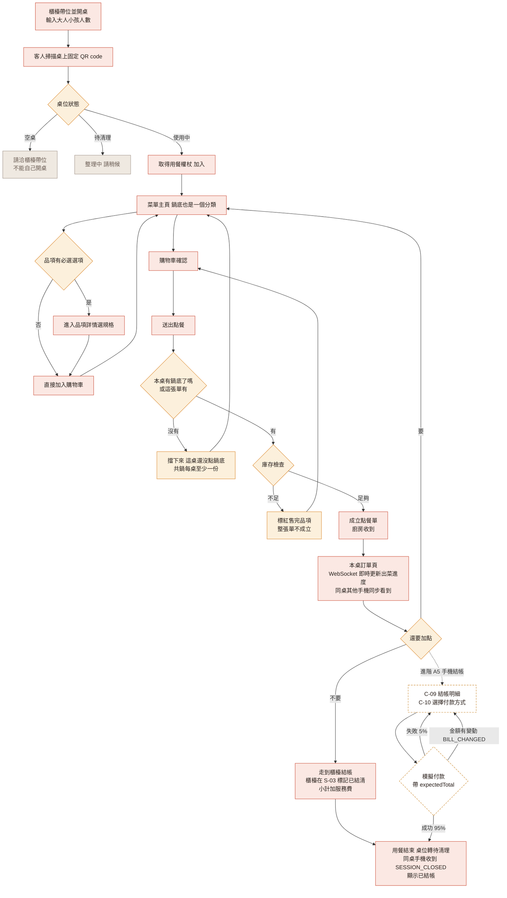
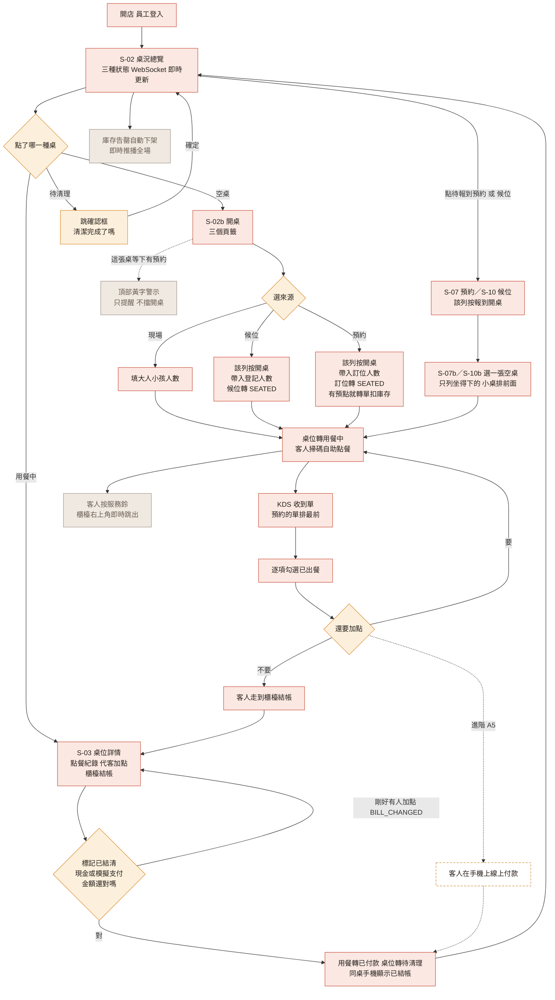
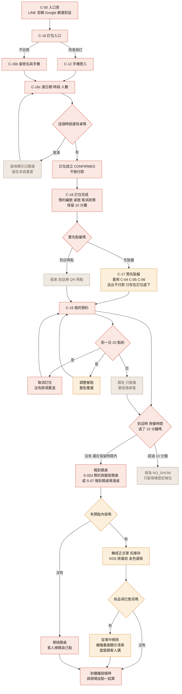

# 10 UI / UX 規格

> 本文件定義「有哪些頁面、每頁長什麼樣、有哪些狀態」。
> 視覺樣式（色票、字體、間距）在 `11-設計系統.md`。
> 產生設計稿的方法在 `12-AI-UI工具與提示詞.md`。
> Figma 上每個畫框右邊那張說明卡的內容在 `13-畫框註解.md`——那是這份文件的濃縮版，改了這裡要順手看一眼那邊。

## 1. 設計原則

這六條是所有畫面的共同準則，設計與實作有疑問時回來看這裡。

| 原則 | 具體意義 |
|---|---|
| **一屏一決定** | 每個畫面只問客人一件事。點餐頁就是點餐，不要塞優惠券、不要塞會員推銷 |
| **長輩與兒童友善** | 內文最小 16px、主要按鈕高度 ≥ 52px、可點擊區 ≥ 48×48px（步進器與 `+` 例外，28×28）、對比度 ≥ 4.5:1、**不依賴顏色傳達資訊**（售完要有文字標籤，不能只變灰） |
| **食物是主角** | 照片佔版面比例要大。介面元素退到背景，讓食材的顏色跳出來 |
| **每個操作都有回饋** | 按下去要有狀態變化。載入中要有骨架屏，不要只有空白 |
| **裝置對應固定** | 顧客點餐畫面只做**手機直式**；櫃檯、廚房、管理畫面只做**橫式平板或電腦**。兩邊都不做全斷點，詳見 §5 |
| **圖片佔位必須標註** | 設計稿與 HTML 草稿裡**不准出現沒有說明的灰色方塊**。每個放圖的位置都要寫明「放哪一種圖 + 尺寸比例 + 搜尋關鍵字」，詳見 `11-設計系統.md` §6.4 |

### 三態規則（每個資料頁面都必須處理）

| 狀態 | 呈現 |
|---|---|
| **載入中** | 骨架屏（灰色方塊佔位），**不要用轉圈圈** |
| **空資料** | 插圖 + 一句話說明 + 一個行動按鈕。例：「還沒點東西呢 / 去看看菜單」 |
| **錯誤** | 明確的中文訊息 + 重試按鈕。**絕對不要顯示英文錯誤碼給客人看** |

### 基礎與進階的分界（2026-09-15 定案）

> 分層判準見 `../spec/02-需求規格.md` §1：**拿掉它，這家店還開不開得成？**
> 開得成就是進階。下面這張表是「頁面層級」的結論，模組內的細項分層看那份文件。

**進階共六塊（A1～A6）、八張畫面：C-09、C-10、C-11、C-15、C-17、C-20、S-09、S-12，全部集中在這裡：**

| 代號 | 畫面 | 拿掉的代價 | 對應規格 |
|---|---|---|---|
| A1 | C-15 消費紀錄 | 會員中心少一個入口，不影響訂位與點餐 | M8 8.8、8.9（8.10 匿名轉會員是前提） |
| A2 | C-17 預先點餐／調整餐點 | C-18 不再問「要先點餐嗎」、C-19 少一顆按鈕、KDS 少金框優先單 | M7 7.E1～7.E3、M4 4.8 |
| A3 | S-09 庫存管理 | 補不了貨、看不到警示；**扣庫存與防超賣仍是基礎**，C-04 的「售完」照常自動出現 | M5 5.7～5.10 |
| A4 | S-12 報表 | 沒有營收數字可看，不影響任何一條營運動線 | M6 6.E2～6.E4 |
| A5 | C-09 結帳明細、C-10 付款方式、C-11 付款完成（顧客線上結帳，也就是「我要結帳」） | 客人不能在手機上自己付款，一律到櫃檯結帳（S-03）；C-08 拿掉「我要結帳」按鈕，只留「用餐完畢請到櫃檯結帳」 | M6 6.E7（原 6.5、6.6、6.8、6.12） |
| A6 | C-20 點數與優惠券（＋C-09 折抵區、C-11 點數列、C-14 入口列） | 沒有集點、沒有優惠券；基礎畫面上本來就不出現任何點數與優惠券字樣 | M8 8.E1、8.E2、M6 6.E5（8.10 是前提） |

> A1 與 A6 都要先有 M8 8.10「匿名轉會員」（C-09 的登入入口）才記得到會員身上，
> 而 C-09 屬於 A5——所以實際的施工順序是 **A5 → A1／A6**。基礎沒有點數也沒有消費紀錄，8.10 一起移到進階。

**這四條線刻意留在基礎，不要順手砍掉：**

- **扣庫存與防超賣**（M3 3.5、M5 5.1～5.6）——這是整個專題技術含量最高的一段
  （整張單原子性、條件式 `UPDATE` 看影響筆數），而且 C-04 的售完標示是它算出來的。
  砍掉庫存**畫面**省的是 CRUD 工，砍掉庫存**扣減**省的是賣點
- **選項群組管理 S-06**——一度列進階（用 SQL 種資料就能 demo），2026-09-15 改回基礎
- **候位**（S-10、S-10b、S-02c）與**服務鈴**（C-21、S-11）——候位是開桌三頁籤的其中一條，
  拿掉 S-02b 就要重畫；服務鈴是多裝置即時同步最好講的一段，成本又低
- **櫃檯結帳**（S-03，M6 6.1～6.3、6.7、6.9～6.11）——客人預設走到櫃檯結帳，
  A5 線上結帳不做的話這是**唯一**的結帳路徑，這條不能砍。結帳防呆（`expectedTotal` 金額比對）跟著留在基礎

**設計稿上怎麼標**：Figma 每個畫框的標題旁邊有一顆膠囊（`基礎必做` ／ `進階・有空才做`），
進階的那八張整格墊一張金黃虛線底板。**位置不動**——C-17 仍然排在預約那一列的原位、
C-20 排在會員那一列 C-15 後面、C-09～C-11 仍然是結帳那一列，才看得出「這條線少了這幾張還是通的」。

---

## 2. 顧客端頁面（手機優先，375px 起）

| 代號 | 頁面 | 級別 | 路由 |
|---|---|---|---|
| C-00 | 入口頁（店外進來的起點） | 基礎 | `/` |
| C-01 | 掃碼進入／桌號確認 | 基礎 | `/t/:tableNo` |
| C-04 | 菜單主頁（含鍋底分類） | 基礎 | `/order/menu` |
| C-04b | 同桌通知・有人加購物車 | 基礎 | 覆蓋層，不是獨立路由 |
| C-04c | 同桌通知・有人送出訂單 | 基礎 | 覆蓋層，不是獨立路由 |
| C-05 | 品項詳情與選項 | 基礎 | `/order/items/:id` |
| C-06 | 購物車 | 基礎 | `/order/cart` |
| C-07 | 送出成功 | 基礎 | `/order/submitted` |
| C-08 | 本桌訂單與出菜進度 | 基礎 | `/order/tickets` |
| C-09 | 結帳明細 | **進階** | `/checkout` |
| C-10 | 付款方式選擇 | **進階** | `/checkout/pay` |
| C-11 | 付款完成 | **進階** | `/checkout/done` |
| C-12 | 會員登入／註冊（輸入手機） | 基礎 | `/auth` |
| C-12b | 輸入驗證碼 | 基礎 | `/auth/otp` |
| C-13 | 會員註冊補資料 | 基礎 | `/auth/register` |
| C-14 | 會員中心 | 基礎 | `/member` |
| C-15 | 消費紀錄 | **進階** | `/member/history` |
| C-16 | 線上訂位入口（會員／匿名） | 基礎 | `/reserve` |
| C-16b | 匿名訂位填資料 | 基礎 | `/reserve/guest` |
| C-16c | 選日期時段人數（送出即訂位成功） | 基礎 | `/reserve/when` |
| C-18 | 訂位完成（在這裡才問要不要先點餐） | 基礎 | `/reserve/:id/done` |
| C-17 | 預先點餐／調整餐點 | **進階** | `/reserve/:id/preorder` |
| C-19 | 我的預約 | 基礎 | `/member/reservations`（不需登入：匿名客人帶訂位權杖也能看） |
| C-20 | 點數與優惠券 | **進階** | `/member/wallet` |
| C-21 | 服務鈴面板 | 基礎 | 彈出層，不是獨立路由 |

> 顧客端共 **25 張**（C-02、C-03 是空號：C-03 選鍋底已併進 C-04）。

> **編號規則**：字尾 b、c 表示同一段流程裡後來補進來的畫面，
> 排序就是流程順序（C-16 訂位入口 → C-16b 匿名填資料 → C-16c 選日期）。
> 沿用既有代號不重編，是因為代號散落在 7 份 spec、ER 圖與流程圖裡。
>
> **C-17 與 C-18 的順序在 2026-09-15 對調了**：現在是 C-16c 選時段 → **C-18 訂位完成** → （可選）C-17 預先點餐。
> 代號沒有跟著重編，理由同上。看到 C-17 排在 C-18 後面不是筆誤。

### C-00 入口頁

> **這張是「人不在店裡」的起點。** 線上訂位與會員登入原本沒有任何畫面連得過去，
> 動線是斷的 —— C-01 是掃桌上的 QR 進來的，人已經坐在店裡了，
> 不會在那裡訂位，所以入口不能掛在 C-01 上。

- 來源：LINE 官方帳號選單、官網「線上訂位」按鈕、Google 商家連結，都指到 `/`
- 上半：店門口形象照（比 C-01 矮，版面讓給入口），店名疊在照片上
- 三個入口，各是一列大按鈕（圖示＋標題＋一行說明＋箭頭）：

| 入口 | 說明 | 去哪 |
|---|---|---|
| 線上訂位 | 先訂位，到店不用排 | C-16 |
| 我的預約 | 查看或取消訂位 | C-19 |
| 會員登入 | 訂位免填資料、查我的預約 | C-12 |

- 底下一句提醒：「已經坐在店裡了？掃桌上的 QR code 就直接開始點餐」
- **店裡的客人不會經過這一頁**，掃碼直接進 C-01

### C-01 掃碼進入

> **桌上的 QR code 是固定的、永遠不換**，內容就是 `/t/A03`。
> **但開桌權在櫃檯**——客人掃了碼，櫃檯還沒開桌的話，他只會看到「請洽櫃檯帶位」。

- **上半**：店家形象照（火鍋冒煙的大圖，佔螢幕 40%），上面疊店名
- **中間**：大字顯示「**A03 桌**」
- **下半**：依桌位狀態顯示

| 桌位狀態 | 畫面 |
|---|---|
| `AVAILABLE` | 「請洽櫃檯帶位」，**沒有開桌按鈕** |
| `OCCUPIED` | **直接進入點餐** |
| `CLEANING` | 「整理中，請稍候」 |

> 舊版有第四種 `RESERVED`（「此桌已預約，請洽櫃檯」）。桌位狀態拿掉它之後，
> 已被預約但還沒報到的桌就是空桌，客人掃到一樣是「請洽櫃檯帶位」——**結果相同，少一個分支**。

- 底部小字：「有訂位？查詢我的預約」
- **結帳之後**：手機停在 C-04 的「已結帳」狀態（見下）；這時再掃同一個 QR，就照上表的桌位狀態走
  （剛結清是待清理 →「整理中，請稍候」），不另外做一個「本次用餐已結束」的分支

> **共鍋店的鍋底規則：每桌至少一份，不是每人一份。** 想點兩鍋就點兩份，沒有上限。
> 原本有一張獨立的「先選鍋底」畫面把流程卡住，**已經拿掉了** ——
> 共鍋是一桌好幾支手機同時點，用一張強制畫面當閘門，等於要大家先協調誰來選，
> 很容易兩個人各選一鍋。現在鍋底就是菜單上的一個分類，
> 規則改在**送出訂單時**擋（`04-API規格.md` §4.5：本桌還沒有鍋底、這張單也沒有，回 `400 SOUP_BASE_REQUIRED`）。
>
> **鴛鴦鍋在資料上就是一個掛了兩個必選群組的品項**，UI 走跟其他有選項的品項同一套詳情頁（C-05）。

### C-04 菜單主頁（最重要的一頁）

```
┌─────────────────────────────┐
│ ← A03桌 · 3人    [服務鈴]     │  ← 固定頂欄
├─────────────────────────────┤
│ 🔍 搜尋菜色                  │
├─────────────────────────────┤
│ 鍋底 肉品 海鮮 蔬菜 火鍋料 ▸│  ← 橫向滑動頁籤，固定
├─────────────────────────────┤
│ ┌─── 本店人氣 TOP 5 ───┐    │  ← P1，橫向捲動卡片
│ │ [圖] [圖] [圖] [圖]   │    │
│ └──────────────────────┘    │
│                              │
│ 肉品                          │
│ ┌──────────────────────┐    │
│ │ [照片]  美國牛五花     │    │  ← 左圖右文，一列一項
│ │ 80x80  厚切3mm        │    │
│ │        $280      [+]  │    │
│ └──────────────────────┘    │
│ ┌──────────────────────┐    │
│ │ [照片]  紐西蘭羊肉  售完│   │  ← 灰階 + 文字標籤
│ └──────────────────────┘    │
├─────────────────────────────┤
│  🛒 購物車 6 項 · $1,420  ▸ │  ← 固定底欄，有東西才出現
└─────────────────────────────┘
```

- **右上角一顆服務鈴按鈕**，點開是 C-21 面板：呼叫服務生／加湯／換鍋撈渣（**沒有「我要結帳」**，要結帳請到櫃檯）
  - 圖示是**櫃檯上按的那種服務鈴**（半圓鈴身＋底座），不是通知鈴鐺。
    通知鈴鐺留給店家端，那邊它真的是「有未處理的呼叫」
  - 出現在**客人坐著等的畫面**：C-04 菜單、C-08 出菜進度
  - C-05 品項詳情、C-06 購物車、C-07 送出成功**刻意沒有** —— 這三張是做完就走的任務畫面，
    返回 C-04 只要一下
  - **不掛紅點**。要告訴客人「同桌有人做了什麼」，用下面的同桌通知條，
    直接說清楚是誰做了什麼，不用他去點開才知道
- 品項列高度至少 96px，照片 80×80，圓角 12px
- `[+]` 按鈕：**無選項的品項直接加入購物車**（少一次點擊）；**有必選選項的品項**點擊整列進入詳情
- 售完品項：照片灰階、價格劃線、名稱旁「售完」文字標籤＋照片上斜蓋「售完」印章、整列不可點
- 分類頁籤固定在頂部，捲動時自動高亮目前分類

#### 鍋底規則（原本的 C-03 併進來）

- 「鍋底」是分類頁籤之一，不再有獨立的強制畫面
- **至少一份的規則在送出訂單時擋**：本桌還沒有鍋底（含預點轉來的單）、這張單也沒有 → 後端 `400 SOUP_BASE_REQUIRED`，
  前端顯示「這桌還沒點鍋底，共鍋至少要一份」
- 理由：一桌好幾支手機同時點，用閘門畫面反而容易兩個人各選一鍋

#### 同桌通知（C-04b、C-04c）

> 共鍋是多人同時點餐，別人加了什麼、送出了沒有，不能只靠自己去翻購物車。

- 通知條從上方滑下、蓋在 appbar 上，停 4 秒自己收回，**不用客人關掉**
- 兩種內容：**有人加入購物車**（誰＋加了什麼）、**有人送出訂單**（第幾單＋幾項幾元）
- 後來的蓋掉前一則，不堆疊
- **出現在結帳前的所有點餐畫面**：C-04、C-05、C-06、C-08。設計稿只畫 C-04b／C-04c 兩張，
  其餘畫面共用同一個元件
- C-09 結帳明細（進階 A5）不放通知條——那是付款的任務畫面；付款前同桌仍可能加點，
  靠付款時的金額比對擋下（`409 BILL_CHANGED`），不靠通知條提醒
- 整桌結清（收到 `SESSION_CLOSED`）之後不再出現

#### 已結帳（整桌結清之後）

> **沒有「結帳中」這個狀態。** 舊版按下「我要結帳」就把整桌鎖成「結帳中」、再推一個鎖定事件給所有手機，
> 還要一條「請服務生取消結帳」的解鎖路徑。現在基礎是客人走到櫃檯結帳，
> 櫃檯按下「標記已結清」的那一刻這次用餐就結束，結清之前同桌照樣可以加點。

- 設計稿 meta 標籤寫 `已結帳`：櫃檯在 S-03 結清（或進階 A5 線上付款成功）後，**整桌手機收到 WebSocket `SESSION_CLOSED`** 一起切到這個狀態
- 菜單內容整個變暗、分類頁籤停用，底部面板換成：
  「這桌已經結帳完成」／「謝謝光臨，歡迎再來」＋按鈕「回到首頁」（→ C-00）
- 前端收到事件就清掉這支手機的用餐權杖；之後再打 `/api/dining-sessions/me/**` 會是 `401 INVALID_SESSION_TOKEN`，前端同樣清掉權杖、導到 C-00（`/`）
- 送出點餐剛好跟結清撞在一起時，後端回 `409 SESSION_CLOSED`「這桌已經結帳，不能再加點」，前端一樣切到這個狀態
- **不再有**「請服務生取消結帳」——沒有鎖定，就沒有解鎖

### C-05 品項詳情與選項

- 頂部大圖（16:9，可左右滑）
- 名稱、價格、描述
- 每個選項群組一個區塊：
  - 標題列：群組名 + 必選標記「**必選**」或「可選 最多 5 項」
  - 單選用大型 radio 卡片；複選用大型 checkbox 卡片
  - 每個選項右側顯示價差 `+$80`（0 元不顯示）
- 數量步進器
- 備註輸入（50 字上限，顯示剩餘字數）
- **固定底欄**：「加入購物車 · $740」，必選未選時停用並顯示「請選擇份量」

### C-06 購物車

- 每列：品項名、已選選項（小字灰色）、備註、數量步進器、小計
- 左滑刪除 + 明顯的刪除按鈕（長輩不會左滑，兩種都要有）
- 底部：合計 + 主按鈕「送出點餐」
- 空購物車 → 空狀態插圖 + 「去看看菜單」

### C-07 送出成功

- 大型勾勾動畫（0.6 秒）
- 「**第 2 單已送出**」
- 「廚房已收到，請稍候」
- 兩顆按鈕：「繼續點餐」（主）／「查看本桌訂單」（次）
- 2 秒後自動跳到 C-08

### C-08 本桌訂單與出菜進度（★多裝置同步的展示舞台）

- 頂部摘要：桌號、人數、用餐時間、目前金額
- 依點餐單分組的卡片：
  ```
  ┌─ 第 1 單 · 18:32 送出 ────────┐
  │ ✅ 麻辣鍋底 ×2      已出餐     │
  │ ⏳ 美國牛五花 ×2    製作中     │
  │    全份・加蔥花                │
  └───────────────────────────────┘
  ```
- 狀態用**圖示 + 文字**，不只靠顏色
- **透過 WebSocket 即時更新**；新單出現時卡片從上方滑入 + 高亮 2 秒（**讓「同步」看得見**）
- 頂部連線狀態指示：斷線時顯示「連線中斷，正在重新連線…」
- **重新連上時自動重抓一次完整資料**（WebSocket 保證快，不保證不漏）
- 底部：「繼續加點」（主）＋一行基礎提示「**用餐完畢請到櫃檯結帳**」
- 「我要結帳」（次）→ C-09 是**進階 A5**（顧客線上結帳）；不做 A5 就拿掉這顆按鈕，只留上面那行提示

### C-09 結帳明細（進階 A5）

> **C-09、C-10、C-11 是進階 A5「顧客線上結帳」**（M6 6.E7，也就是「我要結帳」）。
> 基礎版客人一律到櫃檯結帳（S-03），這三張整條拿掉，C-08 只留「用餐完畢請到櫃檯結帳」。
> 做了 A5 也**沒有「結帳中」狀態**：進到這一頁不會鎖桌，同桌照樣可以加點，付款時用金額比對擋。

- 資料來源 `GET /api/dining-sessions/me/bill`
- 頂部提示「**付款成功後這桌就不能再加點**」
- 全部品項清單（可摺疊）
- 計算區：小計 → 服務費 10% → 合計，**合計字級 32px 粗體**
- 「均分每人 $521」（3 人）
- 未登入：登入入口「登入會員，這次消費會記到你的帳戶」＋「登入／註冊會員」按鈕 → C-12，
  下面一行小字「不登入也可以直接付款」（M8 8.10 匿名轉會員，進階）
- **這是最後一次能登入的地方。** 付款完成後就補不回來了（見 C-11）
- 「使用優惠券／點數折抵」整塊屬於**進階 A6**（規則見 C-20）；不做 A6 就整塊拿掉
- 主按鈕「前往付款」，把畫面上的合計當成 `expectedTotal` 帶進 C-10

### C-10 付款方式（進階 A5）

- 三顆大按鈕，各自的品牌樣式（Apple Pay 黑底白字、Google Pay 白底、LINE Pay 綠底）
- 要付現金的客人：一行提示「要付現金，請直接到櫃檯結帳」，**不發任何通知**（服務鈴已經沒有結帳這一類）；
  付現金走基礎流程，櫃檯在 S-03 標記已結清
- **明顯標註「本系統為教學專題，付款為模擬流程，不會產生實際交易」**（誠實，而且評審會欣賞）
- 按下後：按鈕轉為處理中、全頁遮罩、**禁止重複點擊**、2 秒動畫
- 送 `POST /api/payments`，body `{ "diningSessionId", "method", "expectedTotal" }`（A6 再加 `couponId`、`usePoints`）
- 成功 → C-11；失敗 → 錯誤提示 + 重試
- `409 BILL_CHANGED` → 回 C-09 並提示「**剛剛有人加點，金額更新了，請再確認一次**」
- `409 SESSION_CLOSED`（櫃檯剛好先結清了）→ 切到 C-04 的「已結帳」狀態，不會重複收款

### C-11 付款完成（進階 A5）

- 勾勾動畫、交易編號、金額、付款方式
- **這裡沒有任何登入或註冊入口。** 結帳完這次用餐就結束了，
  這時才叫人註冊，這筆消費也記不回去，只是在關門的時候硬塞一張表單
- 「本次獲得 15 點」那一行屬於**進階 A6**（NT$ 1,562 × 每 100 元 1 點）（回應裡的 `pointsEarned`）；不做 A6 就不顯示
- 「感謝光臨，歡迎再來」
- 付款成功的同時：用餐轉 `PAID`、桌位轉待清理、同桌其他手機收到 `SESSION_CLOSED`，顯示 C-04 的「已結帳」

### C-12 會員登入／註冊

> **不讓客人先選「登入」還是「註冊」。** 他記不得自己註冊過沒有，先叫他選，一半的人會選錯。

- 只問手機號碼，不設密碼。每次登入都發一次驗證碼
- 主按鈕「傳送驗證碼」→ C-12b
- 說明「第一次來也是按這裡」：號碼沒登記過，驗證完直接帶去 C-13 補資料
- 卡片列出會員能做什麼：訂位免重填、換手機也查得到我的預約。
  **不提點數**——消費紀錄（A1）、集點與優惠券（A6）是進階，做了才加進這張卡片
- 次要按鈕「先不登入，繼續」—— 從訂位進來的人可以跳過，改走匿名訂位（C-16b）；
  從結帳（進階 A5）進來的人跳過就直接付款
- 三個入口進得來：C-00 會員登入、C-16 訂位入口、C-09 結帳前登入（進階 A5）。
  **完成後都回到原本那一頁**

### C-12b 輸入驗證碼

- 6 格數字、顯示送到哪支號碼、「改號碼」可回 C-12
- 倒數「04:32 後失效」與「重新傳送（52 秒）」
- 教學專題：驗證碼直接顯示在畫面上，不串真實簡訊閘道
- 驗證通過後後端查這支號碼：**有 → 直接登入；沒有 → C-13 補資料**

### C-13 會員註冊補資料

- 手機欄位唯讀並標「已驗證」
- 怎麼稱呼你、性別、生日三欄，**都不是必填**；次要按鈕「跳過，只留手機就好」
- 同意條款勾選：「**我同意店家保存我的訂位與消費紀錄**」＋條款連結（不提點數）
- 生日只給延伸功能 8.E6 生日優惠用，不顯示在任何地方

### C-14 會員中心

- 會員卡只放**姓名、手機、入會年資**；卡片底用木桌紋理（弱化到不影響對比）。
  **不放**可用點數與累積消費次數——那是進階 A6／A1 的資料，基礎畫面不出現
- 入口列表：

| 入口 | 級別 | 去哪 |
|---|---|---|
| 我的預約（帶出最近一筆與筆數） | 基礎 | C-19 |
| 個人資料 | 基礎 | 修改暱稱（M8 8.7） |
| 消費紀錄 | 進階 A1 | C-15 |
| 點數與優惠券 | 進階 A6 | C-20 |

- 進階那兩列沒做就整列拿掉，其餘照常；「我的預約」沒有預約時顯示空狀態，不要整塊藏起來
- 底部 infobox：「訂位時自動帶入你的姓名與手機，不用每次重填。」
  （舊版寫「每 10 元 1 點」，跟規格的每 100 元 1 點對不起來，一起拿掉）

### C-15 消費紀錄（進階 A1）

- 每次用餐一張卡片：日期、桌號、品項摘要、金額；卡片上的「獲得點數」屬於 A6，沒做 A6 就不顯示
- 「看明細」開 C-09 的唯讀版，含交易編號與付款方式
- 空資料：鍋子線稿＋「還沒有消費紀錄」＋「看看菜單」；載入中用卡片骨架屏
- 拿掉的代價：會員中心少一個入口，不影響訂位與點餐

### C-20 點數與優惠券（進階 A6）

> `/member/wallet`，從 C-14 會員中心的「點數與優惠券」進來。對應 M8 8.E1 集點、8.E2 優惠券、M6 6.E5 優惠券折抵。
> **基礎畫面上不出現任何點數或優惠券字樣**；這些東西只在這一頁、C-09 的折抵區、C-11 的點數列出現，三處都是 A6。
> Figma 排在「會員」那一列 C-15 後面。

- 上方點數餘額卡：大數字＋「每消費 100 元累積 1 點」＋「1 點折 1 元，結帳時使用」
- 兩個頁籤：「優惠券 3」／「點數紀錄」
- 優惠券卡片三種狀態：**可使用／已使用／已過期**。每張顯示名稱、折抵方式（固定金額或百分比打折）、低消、到期日（已使用的改寫用在哪一天）
- **已使用與已過期要有文字標籤，不能只變灰**
- 點數紀錄：每一筆寫日期、+N 點或 −N 點、哪一次消費（資料來自 `point_transaction`）；空的時候「還沒有點數紀錄」

**規則**

- 一次結帳**最多用一張券，不疊加**
- 點數在**付款成功後才入帳**（`POST /api/payments` 回應的 `pointsEarned`）
- 優惠券與點數**只能在 C-09（進階 A5）使用**；櫃檯結帳（S-03）要用的話是 A6 的延伸，這次沒畫
- 前提是 M8 8.10 匿名轉會員（C-09 的登入入口），不然消費記不到會員身上
- 店家端沒有發券畫面，先用種子資料建券

### C-16 線上訂位入口

> **不強迫註冊才能訂位。** 擋在門口要人先註冊，會直接流失一批客人；
> 但會員訂位對雙方都好，所以兩條路都留著，只把會員那張卡放在上面並標「建議」。

- 兩張卡片，各自帶自己的按鈕：
  - **用會員訂**（建議）：姓名電話自動帶入、換手機也查得到、在「我的預約」可自己取消與先點餐 → C-12
  - **直接訂，不註冊**：留姓名與手機就好，**這支手機回得來**，換手機要打電話 → C-16b
- 登入完成後**回到這一頁**繼續訂位，已填的不會不見

> **匿名不是死路。** 建立訂位時後端會發一個 `accessToken`，前端存在這支手機的 `localStorage`，
> 靠它就能回來看訂位、先點餐、改單、取消——完全不需要帳號。
> 只有「換一支手機」或「清掉瀏覽資料」才會斷線，那時候才要打電話。
> 會員卡片的優勢因此不是「能不能改」，而是**換裝置也找得到、不用每次重填**，文案要照這個講。
> （基礎沒有點數，卡片上不要寫「累點」。）

### C-16b 匿名訂位填資料

- **姓名**（必填）：到店叫號用
- **手機號碼**（必填）：店家唯一的聯絡管道，也是到店查訂位的依據
- **電子信箱**（選填）：只用來寄訂位確認信（基礎只存不寄，寄信是延伸，見 M7）
- 不問生日、性別、地址 —— 訂位用不到，多一欄就多一批人放棄；會員註冊時再問
- 底部次要按鈕「改用會員身分訂」，隨時可以切回去
- 店家端 S-07 預約管理看得出這筆是會員還是匿名
- 底部提示改成：「訂位完成後，**這支手機就記住了**，可以隨時回來先點餐或取消。
  換手機或清除瀏覽資料後要查詢，請來電 02-2591-xxxx」

### C-16c 選日期時段人數

> **這一頁送出，訂位就成立了。** 不再有「下一步」把客人往付款推——
> 原本的三步驟（選時間 → 先點餐 → 付款）把訂位綁在金流上，
> 客人要走完三關才知道自己訂到沒有，中途放棄的那批人等於白來。
> 現在**選完時段按下去就訂到了**，先點餐變成訂到位之後的加值選項。

- **拿掉頂部的步驟指示器**（`① ② ③`）。只有一步，就不要假裝有三步
- 月曆（明天 +1 至 +30 天）→ 時段按鈕（5 個，客滿的顯示「已額滿」且不可點）→ 人數步進器 → 顯示「將為您安排 4 人桌」
- 底部主按鈕文案：**「確認訂位」**，右側附帶所選的「9/21（一）18:00・4 位」
- 按下去 → `POST /api/reservations` → `201` 直接跳 C-18
- 客滿（`409 SLOT_UNAVAILABLE`）→ 留在本頁，該時段即時標成「已額滿」並提示重選

### C-18 訂位完成（動線的轉折點）

> **這一頁有兩件事要做**：先讓客人確定「我訂到了」，**然後才問**要不要先點餐。
> 順序不能顛倒——成功訊息被選項擠到下面，客人會不確定到底訂成功沒有。

- 上半：大勾勾 + 「訂位完成」+ 預約編號（大字、可複製）、日期時段、人數、桌號
- **沒有金額欄位、沒有「已付」**。訂位不收錢
- 「加入行事曆」次要按鈕（`.ics`，進階 7.E8）
- 下半：一張獨立的卡片問「**要先點餐嗎？**」
  - 主按鈕「先點餐」＋ 說明「到店直接開始做，出菜排最前面」→ C-17
  - 次要按鈕「到店再點」→ 回 C-00 或 C-19
  - 卡片上標一行：「**現在不用付款**，餐點金額到店結帳時一起算」
- 取消政策（安靜的 infobox）：
  「9/20（日）20:00 前可在『我的預約』取消或修改餐點。逾時請來電 02-2591-xxxx。
  **訂位保留 10 分鐘，逾時視同未到，需現場候位。**」
- 保留 10 分鐘這句跟 C-19 一字不差：過了訂位時間 10 分鐘還沒報到就視為 `NO_SHOW`，只能現場登記候位
- **匿名訂位**多一行提示：「這支手機記住了你的訂位，換手機或清除瀏覽資料後要查詢請來電」

### C-17 預先點餐／調整餐點（進階）

> **同一個畫面做兩件事**：第一次來是「先點餐」，之後從「我的預約」回來是「調整餐點」。
> 後端也是同一支 `PUT`（整批覆蓋），前端只差有沒有帶入現有內容。

- 入口有兩個：C-18 的「先點餐」、C-19 的「預先點餐」／「調整餐點」
- **不再有「要先點餐嗎？」的二選一問句**——那個問題已經在 C-18 問完了，
  進到這一頁就代表客人已經選了要先點
- 頂部：訂位摘要條（日期時段、人數、桌號）+ 「可修改到 9/20（日）20:00」
- 主體：**完全重用菜單流程**（C-04 菜單主頁、C-05 品項詳情、C-06 購物車），不另外做一套
- 差別只在購物車那一步的底部按鈕：
  - 第一次：**「送出預先點餐」**
  - 已有內容：**「更新餐點」**，旁邊一顆 ghost 的「清空預點」
- 送出後**不進付款頁**，直接回 C-19（或 C-18），顯示「已更新」的 toast
- 金額一律標示為「**預估 NT$ 1,340**」，並附一行「到店結帳時一起算，現在不用付款」
- 鍋底在這裡**不強制**：客人可以只先點肉，到店再加鍋底。「每桌至少一份鍋底」是送正式單時才擋
- 過期限進到這頁（直接開網址）：整頁唯讀 + 「已超過修改時間，請來電 02-2591-xxxx」

### C-19 我的預約

- 三個頁籤：即將到來／已完成／已取消
- 「即將到來」頁籤最上面一行提示：「**訂位保留 10 分鐘，逾時視同未到，需現場候位**」（跟 C-18 同一句）
- 「即將到來」的卡片，依預點狀態顯示不同的操作：

| 預點狀態 | 卡片顯示 | 按鈕 |
|---|---|---|
| 未預點 | 「尚未預先點餐」 | **「預先點餐」**（主）／「取消訂位」（danger ghost） |
| 已預點 | 品項摘要 + 「預估 NT$ 1,340」 | **「調整餐點」**（主）／「取消訂位」 |
| 已鎖定（過期限） | 同上 + 「已超過修改時間」 | 兩顆都停用 + 「請來電 02-2591-xxxx」 |

- **金額一律寫「預估」，不寫「已付」。** 沒有任何一筆錢在這個階段被收走
- 取消的二次確認面板：「要取消 9/21 的訂位嗎？」+ 「**沒有款項需要退還**，餐點還沒結帳」
- 匿名客人看到的是單筆訂位詳情（靠 localStorage 的 `accessToken`），不是列表
- **不需登入**：匿名客人帶訂位權杖也能看。路由雖然在 `/member/` 底下，前端不要把 `/member/*` 整包加登入保護，這一頁要放行

> **沒有「改期」這個功能。** 全站文案原本寫「改期或取消」，但 C-19 沒有改期按鈕、
> `04-API規格.md` 沒有改期端點、M7 也沒有這條功能——**要換時間就是取消後重訂**。
> 改期實作起來不是改一個欄位：要先放掉舊桌、對新時段重跑一次區間重疊與 best-fit、
> 中間還可能被別人插隊訂走，等於把「建立訂位」整套再做一次，
> 第 4 週沒有必要為它多開一支 API。**文案一律寫「取消」，不要再出現「改期」。**

### C-21 服務鈴面板

- 底部彈出面板，疊在 C-04 或 C-08 上，不是獨立路由
- **三種呼叫**：呼叫服務生（`SERVICE`）／加湯（`SOUP`）／換鍋撈渣（`POT_CLEAN`）
- 面板底部一行小字「**要結帳請到櫃檯**」
- 按下後面板收起＋綠色 toast「已通知櫃檯，服務生馬上過來」
- 同一種呼叫 60 秒冷卻，按鈕顯示「已通知（48 秒）」
- 櫃檯端 S-11 即時跳出卡片（桌號＋呼叫類型）

> **沒有「我要結帳」。** 舊版第四種呼叫按下去會把整桌鎖住，現在沒有鎖定狀態，這顆就沒有存在的理由。
> 客人要結帳就走去櫃檯，或按「呼叫服務生」。做了進階 A5 的話，線上結帳的入口在 C-08 的「我要結帳」，不在服務鈴裡。

---

## 3. 店家端頁面（桌機／平板，1024px 起）

| 代號 | 頁面 | 級別 | 路由 |
|---|---|---|---|
| S-01 | 員工登入 | 基礎 | `/admin/login` |
| S-02 | 桌況總覽 | 基礎 | `/admin/tables` |
| S-02b | 開桌・現場（填人數） | 基礎 | `/admin/tables/:tableNo/open` |
| S-02c | 開桌・候位 | 基礎 | 同上路由的頁籤，不是獨立路由 |
| S-02d | 開桌・預約 | 基礎 | 同上路由的頁籤，不是獨立路由 |
| S-03 | 桌位詳情 | 基礎 | `/admin/tables/:tableNo` |
| S-04 | 出菜看板 KDS | 基礎 | `/admin/kitchen` |
| S-05 | 菜單管理 | 基礎 | `/admin/menu` |
| S-06 | 選項群組管理 | 基礎 | `/admin/menu/options` |
| S-07 | 預約管理 | 基礎 | `/admin/reservations` |
| S-07b | 預約報到・選桌開桌 | 基礎 | 對話框，疊在 S-07 上，不是獨立路由 |
| S-08 | 座位管理 | 基礎 | `/admin/tables-config` |
| S-09 | 庫存管理 | **進階** | `/admin/inventory` |
| S-10 | 候位管理 | 基礎 | `/admin/waitlist` |
| S-10b | 候位報到・選桌開桌 | 基礎 | 對話框，疊在 S-10 上，不是獨立路由 |
| S-11 | 服務鈴通知面板 | 基礎 | 固定在版面右上，不是獨立路由 |
| S-12 | 報表 | **進階** | `/admin/reports` |

> 店家端共 **17 張**。兩邊合計 **42 張畫面**，另有 8 張元件總表（DS-01～DS-08）；
> C-04 與 S-02 的三態示範是同一張畫面的狀態畫框，不另算張數。

### S-02 桌況總覽（櫃檯主畫面）

> **桌位、訂位、候位是三套獨立的東西，不互相連動。**
> 訂位與候位各自管自己的狀態；桌位只反映現場當下。
> 兩邊只有一個接點：**開桌成功時，把來源那筆訂位或候位轉成已報到。**
>
> 舊版還有一個排程式的 `RESERVED`（訂位前 30 分鐘自動把桌鎖起來），已經移除——
> 那等於把訂位複製一份到桌位上、還要靠 cron 同步，一旦不同步就會出現
> 「畫面顯示空桌、按開桌卻被擋」這種最難查的狀況。
>
> 櫃檯手動「保留」某張桌是**延伸功能**（M2 的 2.E5），基礎不做——
> 它會多一個狀態、多一種顏色、開桌頁每列多一顆按鈕，但不做也不影響主線跑完。

- 左側固定側邊欄（寬 212px、淺底 `surface-2`，選中項 `brand-100` 底）：桌況總覽／出菜看板／預約管理／候位管理；
  「菜單」分組：菜單管理／選項群組／庫存管理（進階 A3）；「設定」分組：座位管理／報表（進階 A4）
- 主區：桌位色塊網格，每格顯示
  ```
  ┌──────────┐
  │   A03    │  ← 桌號 24px 粗體
  │  2大1小   │
  │  38 分鐘  │  ← 超過 100 分鐘變紅並閃爍
  │  $1,420  │
  └──────────┘
  ```
- 狀態色塊（**同時要有文字標籤，不能只靠顏色**）：

  | 狀態 | 顏色 | 標籤 | 點下去 |
  |---|---|---|---|
  | 空桌 `AVAILABLE` | 米灰 `#E6DED2` | 空桌 | → **S-02b 開桌** |
  | 用餐中 `OCCUPIED` | 朱紅 `#C8442E` | 用餐中 | → **S-03 桌位詳情**（看點餐紀錄、櫃檯結帳） |
  | 待清理 `CLEANING` | 灰褐 `#9C8E84` | 待清理 | → **跳確認框**「A05 清潔完成了嗎？」→ 確定後回空桌 |

  **沒有「結帳中／待結帳」這種桌態。** 結清之前都是用餐中，櫃檯在 S-03 按下結清的那一刻直接變待清理。

- 頂部統計列（一條橫排數字，不是一排等寬卡片）：空桌 6／用餐中 6／待清理 2／**待報到預約 4**／候位 3 組
  - 「待報到預約」是今天狀態還是 `CONFIRMED`、而且還沒超過保留時間（用餐時間 +10 分鐘）的筆數，
    **這就是系統唯一的全域提醒**，點它去 S-07
  - 桌格上**不顯示**「幾點有預約」——預約資訊在 S-02b 開桌那一刻才出現，見下一節
- **右上角服務鈴通知面板**（S-11）：未處理的呼叫以卡片堆疊顯示，含桌號與類型，點一下標記已處理。
  類型只有呼叫服務生／加湯／換鍋撈渣三種，**沒有「我要結帳」**
- **透過 WebSocket 即時更新**，不輪詢

#### 待清理的確認框

- 標題「A05 清潔完成了嗎？」，內文「確定後這張桌會變回空桌，可以帶客人入座。」
- 兩顆按鈕：「清潔完成」（primary）／「還沒」（ghost）
- 送 `POST /api/admin/tables/{id}/clean`，成功後卡片就地變成空桌並推播給其他櫃檯裝置

> **為什麼這裡用確認框、而 KDS 的勾選不用。**
> 這是平板上的大色塊，誤觸成本是「一張還沒收的桌變成可帶位」，客人會被帶到髒桌上。
> 一次確認擋得住誤觸，代價只有一次點擊。

### S-02b 開桌（現場／候位／預約）

> **開桌的三種來源集中在同一頁，用頁籤分。** 櫃檯只要記一個動作：點空桌 → 選來源 → 開桌。
> 不做「先跳一個三選一的對話框、再進設定人數」——那是兩次點擊換一次分類，不划算。
>
> 這是「從桌子出發」的入口。「從人出發」的入口在 S-07／S-10 那一列的「報到開桌」（→ S-07b／S-10b 選桌），
> 兩個入口後端是同一組 API，見本章最後一節。

- 頂部：`A06・走道 6 人桌`，右上角關閉
- 三個頁籤，**數字就是提醒**：`現場` ／ `候位 3` ／ `預約 2`
  - 預設停在哪一頁：有可報到的預約 → `預約`；否則有候位 → `候位`；都沒有 → `現場`
  - 數字為 0 的頁籤仍然看得到，但點進去是空狀態

| 頁籤 | 內容 | 每一列的按鈕 |
|---|---|---|
| **現場** | 大人／小孩兩組步進器 | 底部主按鈕「開桌」 |
| **候位** | 已叫號待報到的組別：號碼、姓名、人數、等了幾分鐘 | **每一列自己一顆「開桌」** |
| **預約** | 時間窗內坐得下的預約：時間、姓名、電話末四碼、人數、有沒有預點 | **每一列自己一顆「開桌」** |

- 候位與預約那兩頁**不要再叫客人填人數**——登記／訂位時已經填過了，直接帶入。
  真的要改，開桌後在 S-03 桌位詳情調整
- 每一列的「開桌」是 primary 小按鈕，列本身不可點（避免整列誤觸）

> **延伸功能（M2 的 2.E5）要做手動保留的話**，每一列再多一顆 secondary 的「保留」
> （客人還沒到但要先留桌），保留中的桌再點進來時頂部顯示「這張桌保留給誰」＋「取消保留」。
> 基礎不做。

#### 預約清單的範圍

- 條件：`status = CONFIRMED`、用餐時間落在 **現在 −10 分鐘 ～ +45 分鐘**、`party_size ≤ 這張桌的座位數`
- **−10 就是訂位保留時間**：過了用餐時間 10 分鐘還沒到，視為 `NO_SHOW`，只能現場登記候位。
  清單**自己看時間，不等排程**——NO_SHOW 排程每 5 分鐘才跑一次，最多晚 5 分鐘才把那筆標掉
- 按下開桌時後端再檢查一次：`now > start_time + 10 分` → `409 RESERVATION_EXPIRED`
  「已超過保留時間，請改登記候位」，前端顯示這句並重新載入清單
- **不限定原本配到哪一張桌。** 客人被帶到別張桌是現場常態，清單只看「人數坐得下、時間對得上」
- 每列標示預點狀態：「已預先點餐 4 項」或「未預點」，讓櫃檯知道等下 KDS 會不會跳單
- 「原本配到 A08」只是附帶資訊，開桌後**不會**去改那筆訂位的桌號（見下面）

#### 這張桌稍後有預約的話

頂部顯示一條暖黃警示：

```
⚠ 這張桌 19:30 有預約（陳小姐 4 位），預計用餐到 21:25
```

- **只是提醒，不擋開桌。** 系統不知道這組客人會坐多久、也不知道櫃檯有沒有別的安排
- 三個頁籤都會顯示這條，因為不管從哪個來源開桌都一樣會撞到

#### 確認開桌之後

| 來源 | 要做的事 |
|---|---|
| 現場 | 建立 `dining_session`，帶入填的人數 |
| 候位 | 建立 `dining_session` + 帶入登記人數 + **`waitlist.status` → `SEATED`**，該筆從候位清單消失 |
| 預約 | 建立 `dining_session` + 帶入訂位人數 + **`reservation.status` → `SEATED`** + 有預點就轉成 `is_preorder` 的單並扣庫存，該筆從預約清單消失 |

三種來源共同：桌位轉 `OCCUPIED`、跳回 S-02、WebSocket 推播給其他櫃檯裝置。

> **「清掉來源狀態」這一步不能漏。** 沒改成 `SEATED` 的話，那筆預約會繼續出現在
> 下一張桌的開桌清單上，也會被 NO_SHOW 排程在保留時間（10 分鐘）過後標成未到——
> 客人明明已經坐下了，系統卻記成沒來。**驗收時要專門測這一條。**

> **不要去改 `reservation.table_id`。** 那是「訂位當下配的桌」，只服務容量與區間重疊判斷。
> 客人實際坐哪一張，`dining_session` 已經記下來了（它的 `table_id` 與 `reservation_id`）。
> **本專題不做換桌功能**——客人被帶到別張桌是現場常態，但那是用餐紀錄的事，不是訂位的事。

### S-03 桌位詳情（用餐中的桌點下去）

> **這是基礎唯一的結帳路徑。** 客人預設走到櫃檯結帳；顧客手機上的線上結帳（C-09～C-11）是進階 A5。

- 資料來源 `GET /api/admin/dining-sessions/{id}`
- 上半：桌號、人數、已用餐分鐘數、目前金額
- 中段：**這一桌的點餐紀錄**，依單分組，每單顯示送出時間與品項出餐狀態
- 「代客加點」按鈕 → 櫃檯幫客人點（`source = STAFF`）
- 下半「結帳」區：小計 → 服務費 10% → 合計，按「**標記已結清**」選 `現金` 或 `模擬支付`
  - 送 `POST /api/admin/dining-sessions/{id}/settle`，body `{ "method": "CASH" | "MOCK_PAY", "expectedTotal": 1562.00 }`，
    `expectedTotal` 就是畫面上顯示的合計
  - 送出中按鈕停用，防重複送出（M6 6.11）
  - 成功：用餐紀錄轉 `PAID`、桌位轉 `CLEANING`、這桌的用餐權杖全部失效、
    WebSocket 推 `SESSION_CLOSED` 給同桌手機與其他櫃檯；客人手機切到 C-04 的「已結帳」狀態
  - `409 BILL_CHANGED`「金額有變動，請重新確認」：客人剛好在這時加點了。回應帶最新帳單，
    結帳區就地換成新金額並顯示這句提示，櫃檯跟客人確認後再按一次
  - `409 SESSION_CLOSED`：客人已經在手機上付完（進階 A5），畫面直接轉成已結清，不會重複收款
- 「取消該次用餐」（僅 MANAGER）：客人沒消費就走，桌位直接回空桌

> **為什麼不用「結帳中」把整桌鎖住。** 舊版櫃檯一按結帳就推鎖定事件把客人手機鎖住，
> 等於多一個狀態、多一支解鎖 API，還要處理「鎖了又不結」。現在改成**金額比對**：
> 結清與送出點餐在各自的交易裡搶同一列的鎖（`SELECT ... FOR UPDATE` 那筆 `dining_session`），一定一先一後——
> 點餐先到，結清重算就發現金額不對（`BILL_CHANGED`）；結清先到，點餐看到狀態不是 `OPEN`（`SESSION_CLOSED`）。

### S-04 出菜看板 KDS（廚房主畫面）

- **深色背景**（廚房光線強，深色反而清楚）——這是全站唯一使用深色的頁面
- 卡片式看板，每張 = 一張點餐單
  ```
  ┌────────────────────────┐
  │ A03  第2單   ⏱ 3分鐘   │  ← 桌號 32px
  │ ────────────────────── │
  │ □ 美國牛五花 ×2         │  ← 勾選框 40×40
  │   全份・加蔥花           │
  │ □ 高麗菜 ×1             │
  │ ☑ 麻辣鍋底 ×2   已出     │
  │ ────────────────────── │
  │      [ 整單出完 ]       │
  └────────────────────────┘
  ```
- **預約先點餐的單**：卡片加金色邊框 + 「預約優先」標籤，排最前
- 等待超過 15 分鐘：卡片邊框變紅 + 時間閃爍
- 品項全勾完 → 卡片淡出移除（0.5 秒動畫），並保留一個「最近完成」分頁
- **透過 WebSocket 即時更新**，不輪詢
- 字級全部放大（桌號 32px、品項 20px），廚房站遠也看得到

### S-05 菜單管理

- 左側分類樹，右側品項表格
- 表格欄位：照片縮圖、名稱、分類、價格、庫存、狀態（上架／下架／售完）、操作
- 品項編輯用側邊抽屜（不要跳新頁），含：基本資料、圖片網址、所屬選項群組（多選）、是否鍋底、適合對象
- **快速下架開關**直接放在表格列上（店家最常用的操作）

### S-07 預約管理

- 今日預約清單：時段、姓名、電話（中間遮住）、人數、配桌、預先點餐、狀態、操作；
  頂部統計今日預約／已報到／待報到／逾時未到／已預先點餐
- 看得出這筆是會員還是匿名（C-16b 那條）
- 狀態與操作：

| 情況 | 狀態膠囊 | 操作欄 |
|---|---|---|
| `CONFIRMED`，還在保留時間內 | 已確認 | primary「**報到開桌**」→ S-07b 選一張空桌 |
| `CONFIRMED`，已過用餐時間 10 分鐘（排程還沒標） | **逾時未到** | **沒有報到按鈕**，同一個位置換成 ghost「登記候位」→ S-10 |
| `NO_SHOW` | 逾時未到 | ghost「登記候位」 |
| `SEATED` | 已報到 | 「看桌位」→ S-03 |
| `CANCELLED` | 已取消 | — |

- 逾時那一列**自己看時間**，不等 NO_SHOW 排程——跟 S-02d 的清單、報到 API 的 `RESERVATION_EXPIRED` 是同一條規則
- 兩支排程，都要有手動觸發 API（demo 時不用等到時間）：
  - NO_SHOW：每 5 分鐘，`status = CONFIRMED AND start_time < now − 10 分鐘` → `NO_SHOW`
  - 訂位提醒：用餐前 2 小時發通知（模擬簡訊）
- 標成 `NO_SHOW` 之後**桌位不用動**——桌位本來就沒被鎖，只是這筆不再出現在開桌清單
- 報到開桌做三件事：建立用餐紀錄、有預點（進階 A2）就轉單、**這時候才扣庫存**；扣不到的品項回 soldOut 清單。
  有預點的預約變 `NO_SHOW`：預點不轉單、不扣庫存，也就不需要回補

### S-10 候位管理

- 左側現場登記：怎麼稱呼、電話末四碼、人數 → 取號（只留末四碼，不留全號碼）
- 清單：號碼、姓名、末四碼、人數、登記時間、等待、狀態、操作；
  統計幾組候位中、幾組已叫號待報到、平均等待、今日過號
- 狀態與操作：等待中（`WAITING`）→「叫號」；已叫號（`CALLED`）→ primary「**報到開桌**」→ S-10b ＋「再叫一次」；
  已入座（`SEATED`）、過號（`EXPIRED`）沒有操作
- 叫號後 10 分鐘沒報到，排程自動標成過號；只有「已叫號」會被標，「等待中」不會
- 報到開桌**不用再輸入人數**，登記時填的直接帶進 S-10b

### S-07b／S-10b 選桌開桌對話框（從人出發的開桌）

> **開桌有兩個入口，後端是同一組 API。**
> 從桌子出發：S-02 點空桌 → S-02b／S-02c／S-02d 選來源。
> 從人出發：S-07／S-10 那一列按「報到開桌」→ 這個對話框選一張空桌。
> 兩張畫面**共用同一個元件**，只差標題與資料來源；都是對話框，不是獨立路由（1280×800 畫框裡疊在 S-07／S-10 上）。

- 標題：預約是 `陳怡君・4 位`，候位是 `A12 王先生・3 位`；副標「列出座位數坐得下的空桌」
- 清單來源 `GET /api/admin/tables/available?partySize=4`（COUNTER、MANAGER），
  回 `[{ "tableId", "tableNo", "area", "seats", "upcomingReservationAt": "19:30" | null }]`
  - 只列 `AVAILABLE` 且 `seats ≥ 人數` 的桌
  - 排序：**座位數由小到大，同座位數再依桌號**——剛好坐得下的排最前面，大桌留給大組
  - 每張卡片顯示桌號、區域、座位數
  - 這張桌稍後有預約（`upcomingReservationAt` 有值）→ 卡片上用暖黃小字提醒「19:30 有預約」，
    **只提醒、不擋**，跟 S-02b 頂部那條黃字一致
- 選一張 → 底部主按鈕變成「**開 A05**」；另一顆 ghost「取消」
- 送出：預約呼叫 `POST /api/admin/reservations/{id}/seat`、候位呼叫 `POST /api/admin/waitlist/{id}/seat`，body 都是 `{ "tableId" }`
- 收尾跟 S-02c／S-02d **完全一樣**：來源轉 `SEATED`、桌位轉 `OCCUPIED`、**不改 `reservation.table_id`**、**不檢查區間重疊**；
  預約有預點就轉單扣庫存並回 soldOut 清單；關掉對話框、那一列變成已報到／已入座，WebSocket 推播給其他櫃檯
- **空狀態**：沒有坐得下的空桌 →「目前沒有坐得下的空桌」＋說明「清潔完成或有桌結帳後再試一次」＋按鈕「關閉」
- **兩個櫃檯同時搶同一張桌**：開桌本來就有 `FOR UPDATE`，後到的拿 `409 TABLE_OCCUPIED`，對話框重新載入清單（被開走的那張就不見了）
- 預約那邊拖到超過保留時間才按：`409 RESERVATION_EXPIRED`「已超過保留時間，請改登記候位」，關掉對話框，那一列變成逾時未到

### S-09 庫存管理

- 表格：品項、目前數量、單位、警戒值、狀態、快速補貨
- 排序：**售完的排最前，低於警戒值次之**
- 低量列黃底、售完列紅底 + 「售完」文字
- 「補貨」按鈕開小型彈窗，輸入數量即可
- 頁面頂部警示列：「有 3 項已售完、5 項庫存偏低」

---

## 4. 關鍵流程圖

### 4.1 顧客點餐主流程



**圖例**：紅框 = 正常流程；黃框 = 判斷或例外處理；灰框 = 中止；
金色虛線框與虛線箭頭 = 進階 A5 顧客線上結帳，不做的話客人一律走「到櫃檯結帳」那條。

### 4.2 店家端一日流程



**圖例**：紅框 = 正常流程；黃框 = 判斷或確認；灰框 = 提醒與旁支；金色虛線框 = 進階 A5。

**這張圖的四個重點**

1. **桌況總覽的三種狀態，各自只有一個去向。** 空桌去開桌頁、用餐中去桌位詳情、
   待清理跳確認框。櫃檯不用記「這張桌現在能做什麼」，顏色就是答案。**沒有「結帳中」這種桌態。**
2. **開桌有兩個入口、後端同一組 API。** 從桌子出發是「點空桌 → 選頁籤 → 開桌」（S-02b／c／d）；
   從人出發是「S-07／S-10 那一列按報到開桌 → 選一張空桌」（S-07b／S-10b）。
3. **基礎的結帳只有櫃檯一條。** 客人走到櫃檯，櫃檯在 S-03 按「標記已結清」；
   剛好有人加點就用金額比對擋下來（`BILL_CHANGED`），重新確認再按一次。手機線上付款是進階 A5。
4. **灰色虛線那條是提醒，不是流程。** 這張桌等下有預約只會顯示黃字，不會擋住開桌——
   要不要把桌留給等下那組，是現場的判斷。

### 4.3 訂位與預先點餐流程



**圖例**

| 顏色 | 意義 |
|---|---|
| 紅框 | **基礎必做**——只做這些，訂位到報到開桌就是完整的一條線 |
| 黃框 | **進階**（M7 的 7.E1～7.E3 預先點餐）——整塊拿掉不影響上面那條線 |
| 灰框 | 中止或唯讀狀態（含逾時未到 `NO_SHOW`） |

**這張圖的四個重點**

1. **「訂位成立」在問「要不要先點餐」之前。** 這是這次改版的全部重點：
   客人按下確認就訂到位了，先點餐是訂到之後的加值選項，不是訂位的必經關卡。
2. **回到 C-19 的箭頭有兩條**（先點的、沒先點的都會回到這裡）。
   「我的預約」是事後補點、改單、取消的唯一入口。
3. **整張圖沒有任何一個付款節點。** 餐點金額在到店結帳時才算（基礎是櫃檯 S-03；
   進階 A5 才是手機上的 C-09～C-11），所以改單與取消都不需要退款流程。
4. **訂位只保留 10 分鐘。** 過了用餐時間 10 分鐘還沒報到就視為 `NO_SHOW`，只能現場候位。
   開桌清單與報到 API 都自己看時間（`RESERVATION_EXPIRED`），不等每 5 分鐘一次的排程。
   有預點的也一樣：預點不轉單、不扣庫存，沒有東西要回補。

---

## 5. RWD 斷點

| 斷點 | 寬度 | 主要使用者 |
|---|---|---|
| `sm` | 375–639px | **顧客手機（主要）** |
| `md` | 640–1023px | 平板、大螢幕手機 |
| `lg` | 1024–1439px | **店家平板／筆電（主要）** |
| `xl` | ≥1440px | 店家桌機 |

### 5.1 兩種裝置，各做一種，不做中間

| | 顧客端 | 店家端 |
|---|---|---|
| **裝置** | 手機**直式** | **橫式**平板或電腦 |
| **畫面代號** | C-00 ～ C-21（25 張） | S-01 ～ S-12（17 張） |
| **設計稿畫框** | **375 × 812** | **1280 × 800** |
| **實作範圍** | 375px ～ 640px | ≥ 1024px |
| **超出範圍時** | 內容置中、最大寬度 480px（模擬手機） | 顯示「請將裝置橫放，或改用電腦操作」 |

**例外**：S-04 出菜看板 KDS 假設是**固定橫式大螢幕**，不做任何 RWD，直接鎖 1920×1080。

> 不要兩邊都做全斷點。時間不夠，而且真實店裡也不會有人拿直式平板在櫃檯結帳。

---

## 6. 無障礙與友善設計檢查表

實作完每個頁面後逐條檢查：

- [ ] 內文 ≥ 16px，重要數字 ≥ 20px
- [ ] 所有可點擊區 ≥ 48×48px（含 padding）。**唯一例外：數量步進器與菜單列的 `+` 是 28×28，見 `11-設計系統.md` §5.4**
- [ ] 文字與背景對比度 ≥ 4.5:1（用 WebAIM Contrast Checker 檢查）
- [ ] **狀態不只用顏色表達**（售完、已出餐、桌況都要有文字或圖示）
- [ ] 所有圖片有 `alt`
- [ ] 表單每個輸入框有 `<label>`
- [ ] 錯誤訊息是中文、具體、可行動（「請輸入 10 位數手機號碼」而非「格式錯誤」）
- [ ] 可用鍵盤 Tab 走完整個表單
- [ ] 按鈕在載入中時停用並顯示狀態，防止重複送出
- [ ] 重要操作（送出點餐、櫃檯標記已結清、取消預約；進階 A5 的付款）有二次確認或明確的選擇步驟
- [ ] 動畫可被 `prefers-reduced-motion` 關閉

---

## 7. 微互動清單（低成本、高質感）

這些每個成本 10～30 分鐘，但讓整個系統「有人做過」的感覺差很多：

| 位置 | 效果 |
|---|---|
| 加入購物車 | 品項照片飛向底部購物車圖示（0.4 秒） |
| 購物車數字 | 變動時彈跳一下 |
| 送出點餐成功 | 勾勾描邊動畫 |
| 本桌訂單新單出現 | 卡片從上方滑入 + 短暫高亮 |
| 出菜狀態變更 | ⏳ 轉為 ✅ 時旋轉淡入 |
| KDS 整單完成 | 卡片淡出縮小 |
| 載入中 | 火鍋冒泡的骨架屏動畫（不要通用轉圈） |
| 售完品項 | 照片灰階 + 「售完」印章斜蓋上去 |
| 步進器 | 按下時輕微縮放回饋 |

> **注意**：全部動畫都要在 `prefers-reduced-motion: reduce` 時停用。
