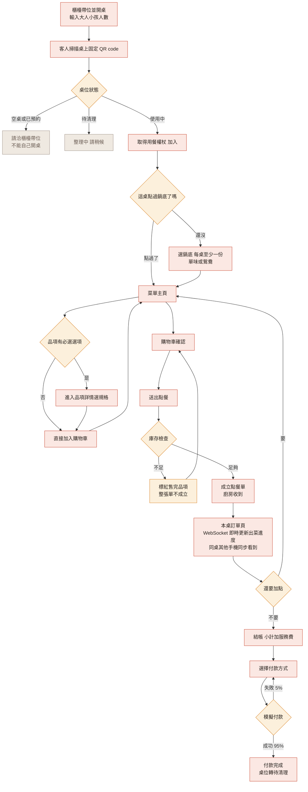
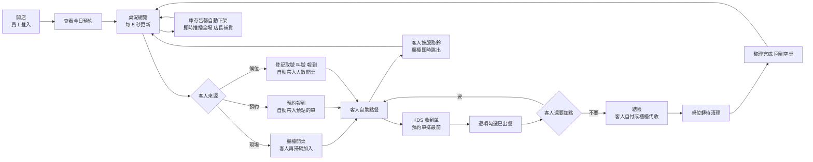

# 10 UI / UX 規格

> 本文件定義「有哪些頁面、每頁長什麼樣、有哪些狀態」。
> 視覺樣式（色票、字體、間距）在 `11-設計系統.md`。
> 產生設計稿的方法在 `12-AI-UI工具與提示詞.md`。

## 1. 設計原則

這四條是所有畫面的共同準則，設計與實作有疑問時回來看這裡。

| 原則 | 具體意義 |
|---|---|
| **一屏一決定** | 每個畫面只問客人一件事。點餐頁就是點餐，不要塞優惠券、不要塞會員推銷 |
| **長輩與兒童友善** | 內文最小 16px、主要按鈕高度 ≥ 52px、可點擊區 ≥ 48×48px、對比度 ≥ 4.5:1、**不依賴顏色傳達資訊**（售完要有文字標籤，不能只變灰） |
| **食物是主角** | 照片佔版面比例要大。介面元素退到背景，讓食材的顏色跳出來 |
| **每個操作都有回饋** | 按下去要有狀態變化。載入中要有骨架屏，不要只有空白 |

### 三態規則（每個資料頁面都必須處理）

| 狀態 | 呈現 |
|---|---|
| **載入中** | 骨架屏（灰色方塊佔位），**不要用轉圈圈** |
| **空資料** | 插圖 + 一句話說明 + 一個行動按鈕。例：「還沒點東西呢 / 去看看菜單」 |
| **錯誤** | 明確的中文訊息 + 重試按鈕。**絕對不要顯示英文錯誤碼給客人看** |

---

## 2. 顧客端頁面（手機優先，375px 起）

| 代號 | 頁面 | 級別 | 路由 |
|---|---|---|---|
| C-01 | 掃碼進入／桌號確認 | 基礎 | `/t/:tableNo` |
| C-02 | 開桌設定人數 | 基礎 | `/t/:tableNo/open` |
| C-02b | 輸入開桌碼加入 | 基礎 | `/t/:tableNo/join` |
| C-03 | 選鍋底（開桌後強制） | 基礎 | `/order/soup-base` |
| C-04 | 菜單主頁 | 基礎 | `/order/menu` |
| C-05 | 品項詳情與選項 | 基礎 | `/order/items/:id` |
| C-06 | 購物車 | 基礎 | `/order/cart` |
| C-07 | 送出成功 | 基礎 | `/order/submitted` |
| C-08 | 本桌訂單與出菜進度 | 基礎 | `/order/tickets` |
| C-09 | 結帳明細 | 基礎 | `/checkout` |
| C-10 | 付款方式選擇 | 基礎 | `/checkout/pay` |
| C-11 | 付款完成 | 基礎 | `/checkout/done` |
| C-12 | 會員登入（手機驗證） | 基礎 | `/auth/login` |
| C-13 | 會員註冊補資料 | 基礎 | `/auth/register` |
| C-14 | 會員中心 | 基礎 | `/member` |
| C-15 | 消費紀錄 | 基礎 | `/member/history` |
| C-16 | 預約 步驟1 日期時段人數 | 基礎 | `/reserve` |
| C-17 | 預約 步驟2 預先點餐 | 基礎 | `/reserve/preorder` |
| C-18 | 預約 步驟3 付款完成 | 基礎 | `/reserve/done` |
| C-19 | 我的預約 | 基礎 | `/member/reservations` |
| C-21 | 服務鈴面板 | 基礎 | 彈出層，不是獨立路由 |

### C-01 掃碼進入

> **桌上的 QR code 是固定的、永遠不換**，內容就是 `/t/A03`。
> **但開桌權在櫃檯**——客人掃了碼，櫃檯還沒開桌的話，他只會看到「請洽櫃檯帶位」。

- **上半**：店家形象照（火鍋冒煙的大圖，佔螢幕 40%），上面疊店名
- **中間**：大字顯示「**A03 桌**」
- **下半**：依桌位狀態顯示

| 桌位狀態 | 畫面 |
|---|---|
| `AVAILABLE` | 「請洽櫃檯帶位」，**沒有開桌按鈕** |
| `RESERVED` | 「此桌已預約，請洽櫃檯」 |
| `OCCUPIED` | **直接進入點餐**（開桌碼設定開啟時才顯示 4 格輸入） |
| `CLEANING` | 「整理中，請稍候」 |

- 底部小字：「有訂位？查詢我的預約」
- **結帳後再掃同一個 QR**：顯示「本次用餐已結束，感謝光臨」

### C-02 開桌設定人數（**櫃檯端畫面**，不在顧客手機上）

> 人數由櫃檯輸入，比客人自填準。**人數不參與金額計算**，用途是座位安排、分帳參考值、兒童友善推薦、客單價統計。

- 兩組大型步進器（`−` 數字 `+`），按鈕直徑 56px：大人 0–10、小孩 0–10
- 即時顯示「共 3 位」
- 主按鈕「開桌」，人數為 0 時停用
- 開桌碼設定開啟時，開桌後顯示 4 碼密碼供服務生告知客人

### C-03 選鍋底（★共鍋店的特色，不要跳過）

> **我們是共鍋店：鍋底「每桌至少一份」，不是「每人一份」。** 想點兩鍋就點兩份，沒有上限。

- 標題「**先選鍋底**」+ 副標「這桌至少要點一份鍋底」
- 四張大卡片，各含照片、名稱、價格、辣度圖示：
  - **麻辣 $480**／**酸菜白肉 $420**／**昆布 $380**（單味，可直接加入）
  - **鴛鴦鍋底**（點進去要選「左鍋湯底」與「右鍋湯底」，價格 = 兩個半價相加）
- 每張卡片有數量步進器
- 底部即時顯示「已選 1 鍋」與累計金額
- 一份都沒選時主按鈕停用並顯示「請至少選擇一份鍋底」
- 選好後按「下一步，開始點菜」

> **鴛鴦鍋在資料上就是一個掛了兩個必選群組的品項**，UI 上跟其他有選項的品項走同一套詳情頁（C-05）。

### C-04 菜單主頁（最重要的一頁）

```
┌─────────────────────────────┐
│ ← A03桌 · 3人    🔔 已點 6 項 │  ← 固定頂欄
├─────────────────────────────┤
│ 🔍 搜尋菜色                  │
├─────────────────────────────┤
│ 鍋底 肉品 海鮮 蔬菜 火鍋料 ▸│  ← 橫向滑動頁籤，固定
├─────────────────────────────┤
│ ┌─── 本店人氣 TOP 5 ───┐    │  ← P1，橫向捲動卡片
│ │ [圖] [圖] [圖] [圖]   │    │
│ └──────────────────────┘    │
│                              │
│ 肉品                          │
│ ┌──────────────────────┐    │
│ │ [照片]  美國牛五花     │    │  ← 左圖右文，一列一項
│ │ 80x80  厚切3mm        │    │
│ │        $280      [+]  │    │
│ └──────────────────────┘    │
│ ┌──────────────────────┐    │
│ │ [照片]  紐西蘭羊肉  售完│   │  ← 灰階 + 文字標籤
│ └──────────────────────┘    │
├─────────────────────────────┤
│  🛒 購物車 6 項 · $1,420  ▸ │  ← 固定底欄，有東西才出現
└─────────────────────────────┘
```

- **右上角固定一顆服務鈴按鈕**（鈴鐺圖示），點開是四個選項：呼叫服務生／加湯／換鍋撈渣／我要結帳
- 品項列高度至少 96px，照片 80×80，圓角 12px
- `[+]` 按鈕：**無選項的品項直接加入購物車**（少一次點擊）；**有必選選項的品項**點擊整列進入詳情
- 售完品項：照片灰階、價格劃線、右上角「售完」標籤、整列不可點
- 分類頁籤固定在頂部，捲動時自動高亮目前分類

### C-05 品項詳情與選項

- 頂部大圖（16:9，可左右滑）
- 名稱、價格、描述
- 每個選項群組一個區塊：
  - 標題列：群組名 + 必選標記「**必選**」或「可選 最多 5 項」
  - 單選用大型 radio 卡片；複選用大型 checkbox 卡片
  - 每個選項右側顯示價差 `+$80`（0 元不顯示）
- 數量步進器
- 備註輸入（50 字上限，顯示剩餘字數）
- **固定底欄**：「加入購物車 · $740」，必選未選時停用並顯示「請選擇份量」

### C-06 購物車

- 每列：品項名、已選選項（小字灰色）、備註、數量步進器、小計
- 左滑刪除 + 明顯的刪除按鈕（長輩不會左滑，兩種都要有）
- 底部：合計 + 主按鈕「送出點餐」
- 空購物車 → 空狀態插圖 + 「去看看菜單」

### C-07 送出成功

- 大型勾勾動畫（0.6 秒）
- 「**第 2 單已送出**」
- 「廚房已收到，請稍候」
- 兩顆按鈕：「繼續點餐」（主）／「查看本桌訂單」（次）
- 2 秒後自動跳到 C-08

### C-08 本桌訂單與出菜進度（★多裝置同步的展示舞台）

- 頂部摘要：桌號、人數、用餐時間、目前金額
- 依點餐單分組的卡片：
  ```
  ┌─ 第 1 單 · 18:32 送出 ────────┐
  │ ✅ 麻辣鍋底 ×2      已出餐     │
  │ ⏳ 美國牛五花 ×2    製作中     │
  │    全份・加蔥花                │
  └───────────────────────────────┘
  ```
- 狀態用**圖示 + 文字**，不只靠顏色
- **透過 WebSocket 即時更新**；新單出現時卡片從上方滑入 + 高亮 2 秒（**讓「同步」看得見**）
- 頂部連線狀態指示：斷線時顯示「連線中斷，正在重新連線…」
- **重新連上時自動重抓一次完整資料**（WebSocket 保證快，不保證不漏）
- 底部：「繼續加點」（主）／「我要結帳」（次）

### C-09 結帳明細

- 全部品項清單（可摺疊）
- 計算區：小計 → 服務費 10% → 合計，**合計字級 32px 粗體**
- 「均分每人 $521」（3 人）
- 會員：顯示可獲得點數；非會員：「輸入手機號碼累積點數」輸入框
- 主按鈕「前往付款」

### C-10 付款方式

- 三顆大按鈕，各自的品牌樣式（Apple Pay 黑底白字、Google Pay 白底、LINE Pay 綠底）
- **明顯標註「本系統為教學專題，付款為模擬流程，不會產生實際交易」**（誠實，而且評審會欣賞）
- 按下後：按鈕轉為處理中、全頁遮罩、**禁止重複點擊**、2 秒動畫
- 成功 → C-11；失敗 → 錯誤提示 + 重試

### C-11 付款完成

- 勾勾動畫、交易編號、金額、獲得點數
- 「加入會員享更多優惠」（非會員時）
- 「感謝光臨，歡迎再來」

### C-16～C-18 預約三步驟

- 頂部步驟指示 `① 選時間 ─ ② 先點餐 ─ ③ 完成`
- **C-16**：月曆（今天 +1 至 +30 天）→ 時段按鈕（5 個，客滿的顯示「已額滿」且不可點）→ 人數步進器 → 顯示「將為您安排 4 人桌」
- **C-17**：「要先點餐嗎？」兩個選項：「先點餐（到店優先上菜）」／「到店再點」。選前者進入菜單流程並須付款
- **C-18**：預約編號、日期時段、桌號、金額、「加入行事曆」按鈕、取消政策說明

---

## 3. 店家端頁面（桌機／平板，1024px 起）

| 代號 | 頁面 | 級別 | 路由 |
|---|---|---|---|
| S-01 | 員工登入 | 基礎 | `/admin/login` |
| S-02 | 桌況總覽 | 基礎 | `/admin/tables` |
| S-03 | 桌位詳情 | 基礎 | `/admin/tables/:id` |
| S-04 | 出菜看板 KDS | 基礎 | `/admin/kitchen` |
| S-05 | 菜單管理 | 基礎 | `/admin/menu` |
| S-06 | 選項群組管理 | 基礎 | `/admin/menu/options` |
| S-07 | 預約管理 | 基礎 | `/admin/reservations` |
| S-08 | 座位管理 | 基礎 | `/admin/tables-config` |
| S-09 | 庫存管理 | 基礎 | `/admin/inventory` |
| S-10 | 候位管理 | 基礎 | `/admin/waitlist` |
| S-11 | 服務鈴通知面板 | 基礎 | 固定在版面右上，不是獨立路由 |
| S-12 | 報表 | 進階 | `/admin/reports` |

### S-02 桌況總覽（櫃檯主畫面）

- 左側固定側邊欄：桌況／出菜／預約／菜單／庫存／報表
- 主區：桌位色塊網格，每格顯示
  ```
  ┌──────────┐
  │   A03    │  ← 桌號 24px 粗體
  │  2大1小   │
  │  38 分鐘  │  ← 超過 100 分鐘變紅並閃爍
  │  $1,420  │
  └──────────┘
  ```
- 狀態色塊（**同時要有文字標籤，不能只靠顏色**）：
  | 狀態 | 顏色 | 標籤 |
  |---|---|---|
  | 空桌 | 米灰 `#E6DED2` | 空桌 |
  | 使用中 | 朱紅 `#C8442E` | 用餐中 |
  | 已預約 | 暖黃 `#E8A33D` | 已預約 19:30 |
  | 待清理 | 灰褐 `#9C8E84` | 待清理 |
- 頂部統計列：空桌 4／用餐中 6／待清理 2／候位 3 組
- **右上角服務鈴通知面板**：未處理的呼叫以卡片堆疊顯示，含桌號與類型，點一下標記已處理
- **透過 WebSocket 即時更新**，不輪詢

### S-04 出菜看板 KDS（廚房主畫面）

- **深色背景**（廚房光線強，深色反而清楚）——這是全站唯一使用深色的頁面
- 卡片式看板，每張 = 一張點餐單
  ```
  ┌────────────────────────┐
  │ A03  第2單   ⏱ 3分鐘   │  ← 桌號 32px
  │ ────────────────────── │
  │ □ 美國牛五花 ×2         │  ← 勾選框 40×40
  │   全份・加蔥花           │
  │ □ 高麗菜 ×1             │
  │ ☑ 麻辣鍋底 ×2   已出     │
  │ ────────────────────── │
  │      [ 整單出完 ]       │
  └────────────────────────┘
  ```
- **預約先點餐的單**：卡片加金色邊框 + 「預約優先」標籤，排最前
- 等待超過 15 分鐘：卡片邊框變紅 + 時間閃爍
- 品項全勾完 → 卡片淡出移除（0.5 秒動畫），並保留一個「最近完成」分頁
- **透過 WebSocket 即時更新**，不輪詢
- 字級全部放大（桌號 32px、品項 20px），廚房站遠也看得到

### S-05 菜單管理

- 左側分類樹，右側品項表格
- 表格欄位：照片縮圖、名稱、分類、價格、庫存、狀態（上架／下架／售完）、操作
- 品項編輯用側邊抽屜（不要跳新頁），含：基本資料、圖片網址、所屬選項群組（多選）、是否鍋底、適合對象
- **快速下架開關**直接放在表格列上（店家最常用的操作）

### S-09 庫存管理

- 表格：品項、目前數量、單位、警戒值、狀態、快速補貨
- 排序：**售完的排最前，低於警戒值次之**
- 低量列黃底、售完列紅底 + 「售完」文字
- 「補貨」按鈕開小型彈窗，輸入數量即可
- 頁面頂部警示列：「有 3 項已售完、5 項庫存偏低」

---

## 4. 關鍵流程圖

### 4.1 顧客點餐主流程



**圖例**：紅框 = 正常流程；黃框 = 判斷或例外處理；灰框 = 中止。

### 4.2 店家端一日流程



---

## 5. RWD 斷點

| 斷點 | 寬度 | 主要使用者 |
|---|---|---|
| `sm` | 375–639px | **顧客手機（主要）** |
| `md` | 640–1023px | 平板、大螢幕手機 |
| `lg` | 1024–1439px | **店家平板／筆電（主要）** |
| `xl` | ≥1440px | 店家桌機 |

- 顧客端：**只做 375px～640px**，更寬時內容置中、最大寬度 480px（模擬手機）
- 店家端：**只做 ≥1024px**，明確標示「請使用平板或電腦操作」
- 不要兩邊都做全斷點，時間不夠而且沒必要

---

## 6. 無障礙與友善設計檢查表

實作完每個頁面後逐條檢查：

- [ ] 內文 ≥ 16px，重要數字 ≥ 20px
- [ ] 所有可點擊區 ≥ 48×48px（含 padding）
- [ ] 文字與背景對比度 ≥ 4.5:1（用 WebAIM Contrast Checker 檢查）
- [ ] **狀態不只用顏色表達**（售完、已出餐、桌況都要有文字或圖示）
- [ ] 所有圖片有 `alt`
- [ ] 表單每個輸入框有 `<label>`
- [ ] 錯誤訊息是中文、具體、可行動（「請輸入 10 位數手機號碼」而非「格式錯誤」）
- [ ] 可用鍵盤 Tab 走完整個表單
- [ ] 按鈕在載入中時停用並顯示狀態，防止重複送出
- [ ] 重要操作（送出點餐、付款、取消預約）有二次確認
- [ ] 動畫可被 `prefers-reduced-motion` 關閉

---

## 7. 微互動清單（低成本、高質感）

這些每個成本 10～30 分鐘，但讓整個系統「有人做過」的感覺差很多：

| 位置 | 效果 |
|---|---|
| 加入購物車 | 品項照片飛向底部購物車圖示（0.4 秒） |
| 購物車數字 | 變動時彈跳一下 |
| 送出點餐成功 | 勾勾描邊動畫 |
| 本桌訂單新單出現 | 卡片從上方滑入 + 短暫高亮 |
| 出菜狀態變更 | ⏳ 轉為 ✅ 時旋轉淡入 |
| KDS 整單完成 | 卡片淡出縮小 |
| 載入中 | 火鍋冒泡的骨架屏動畫（不要通用轉圈） |
| 售完品項 | 照片灰階 + 「售完」印章斜蓋上去 |
| 步進器 | 按下時輕微縮放回饋 |

> **注意**：全部動畫都要在 `prefers-reduced-motion: reduce` 時停用。
