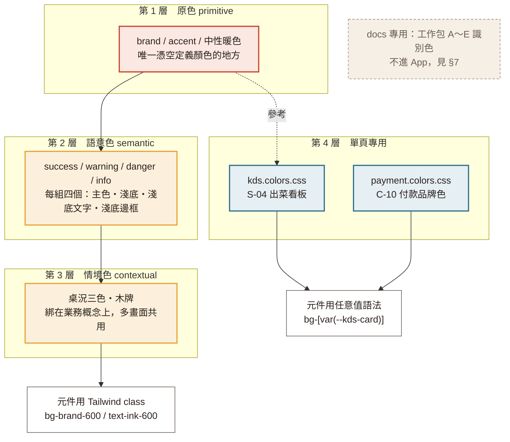

# 14 色彩 Token

> 這份文件講的是**顏色在 React 專案裡放在哪、叫什麼名字、什麼時候用哪一個**。
> 色票本身的設計理由（為什麼是紅湯紅、為什麼底色不用純白）在 [11-設計系統.md](11-設計系統.md) §2，這裡不重複。
>
> **寫任何一個元件之前先看 §3 的三條規則和 §4 的全表。**

---

## 1. 為什麼要先做這件事

設計稿是 52 張獨立 HTML，顏色目前的狀況：

| 現況 | 數字 |
|---|---|
| `_shared.css` 的 `:root` 有名字的色值 | 24 個 |
| `_shared.css` 整份實際出現的色值 | 46 個 |
| **沒有名字、直接寫死在規則裡的** | **22 個** |
| HTML 裡硬寫顏色的地方 | 57 處，分布在 10 個檔 |

那 22 個沒名字的色值不是多餘的，它們有真實用途——例如淺底提示框的深色字（`#1F4E66`、`#2A5637`、`#7D4A12`、`#7A1B15`）四個都在用，卻四個都沒有名字，於是在 `c06`、`c08`、`c09` 又被人手動抄了一次到 `style=""` 裡。

前端是 5 個人分頭做、每人前後端都碰（[05-開發流程與分工.md](../spec/05-開發流程與分工.md) §1.4.2）。**沒有 token 的顏色一定會長歪**：同一個「淺黃底上的警告字」五個人會寫出五個相近但不同的褐色，而且沒人會發現。

所以這次把顏色分成兩類落地：**共用的**進全站 token 檔，**只有一個畫面用的**放那個畫面旁邊。

---

## 2. 檔案配置



**圖例**：紅框 = 原色，全站顏色的源頭；金框 = 從原色衍生的語意與情境色；藍框 = 只有單一畫面用的色；白框 = 元件實際怎麼寫；灰虛線框 = 不進 App 的文件用色。實線箭頭 = 依賴關係，虛線 = 只是配色時參考。

| 檔案 | 放什麼 | 誰動它 |
|---|---|---|
| `frontend/src/styles/tokens.colors.css` | 全站共用的 token（`@theme`） | 要改請先在群組講，這一個檔影響 33 張畫面 |
| `frontend/src/features/admin/kds/kds.colors.css` | S-04 出菜看板的深色 | 做工作包 B 的人 |
| `frontend/src/features/customer/payment/payment.colors.css` | C-10 的外部支付品牌色 | 做工作包 C 的人 |
| `frontend/src/style.css` | 只有兩行 `@import`，不要在這裡寫顏色 | — |

共用檔是 Tailwind v4 的 `@theme`，每個 `--color-*` 會自動長出 utility：

```
--color-brand-600   →   bg-brand-600 / text-brand-600 / border-brand-600
--shadow-card       →   shadow-card
```

寫在 `style` 或 SVG 屬性裡時用 `var(--color-brand-600)`，SVG 的 `fill` / `stroke` 也吃 CSS 變數，所以 **S-03b 的倒數環、S-12 的長條圖都不需要另外寫 hex**。

---

## 3. 三條規則

1. **元件裡不准再出現 `#hex`。** 要顏色就用 token。Code review 看到 hex 就退。
2. **只有一個畫面用得到的顏色不進共用檔**，放那個畫面旁邊的 `*.colors.css`，並在檔頭寫清楚「只有這個畫面用」。
3. **要加新顏色，先回答「現有的哪一個不能用」。** 答不出來就不要加。

---

## 4. 共用 token 全表

<div style="display:flex;flex-wrap:wrap;gap:6px;margin:16px 0">
<span style="display:inline-block;padding:6px 10px;border-radius:6px;font-size:12px;background:#A63522;color:#fff">brand-700</span>
<span style="display:inline-block;padding:6px 10px;border-radius:6px;font-size:12px;background:#C8442E;color:#fff">brand-600</span>
<span style="display:inline-block;padding:6px 10px;border-radius:6px;font-size:12px;background:#DB5B42;color:#fff">brand-500</span>
<span style="display:inline-block;padding:6px 10px;border-radius:6px;font-size:12px;background:#FBE8E3;color:#A63522">brand-100</span>
<span style="display:inline-block;padding:6px 10px;border-radius:6px;font-size:12px;background:#C9862A;color:#fff">accent-600</span>
<span style="display:inline-block;padding:6px 10px;border-radius:6px;font-size:12px;background:#E8A33D;color:#2B211C">accent-500</span>
<span style="display:inline-block;padding:6px 10px;border-radius:6px;font-size:12px;background:#EBD3A6;color:#2B211C">accent-200</span>
<span style="display:inline-block;padding:6px 10px;border-radius:6px;font-size:12px;background:#FCF0DC;color:#7D4A12">accent-100</span>
<span style="display:inline-block;padding:6px 10px;border-radius:6px;font-size:12px;background:#FBF7F0;color:#2B211C;border:1px solid #E6DED2">paper</span>
<span style="display:inline-block;padding:6px 10px;border-radius:6px;font-size:12px;background:#FFFFFF;color:#2B211C;border:1px solid #E6DED2">surface</span>
<span style="display:inline-block;padding:6px 10px;border-radius:6px;font-size:12px;background:#F5EFE5;color:#2B211C">surface-2</span>
<span style="display:inline-block;padding:6px 10px;border-radius:6px;font-size:12px;background:#EDE4D6;color:#2B211C">surface-3</span>
<span style="display:inline-block;padding:6px 10px;border-radius:6px;font-size:12px;background:#E6DED2;color:#2B211C">line</span>
<span style="display:inline-block;padding:6px 10px;border-radius:6px;font-size:12px;background:#DED2C0;color:#2B211C">line-strong</span>
<span style="display:inline-block;padding:6px 10px;border-radius:6px;font-size:12px;background:#2B211C;color:#fff">ink-900</span>
<span style="display:inline-block;padding:6px 10px;border-radius:6px;font-size:12px;background:#6B5D54;color:#fff">ink-600</span>
<span style="display:inline-block;padding:6px 10px;border-radius:6px;font-size:12px;background:#9C8E84;color:#fff">ink-400</span>
<span style="display:inline-block;padding:6px 10px;border-radius:6px;font-size:12px;background:#3F7A4E;color:#fff">success</span>
<span style="display:inline-block;padding:6px 10px;border-radius:6px;font-size:12px;background:#D98324;color:#fff">warning</span>
<span style="display:inline-block;padding:6px 10px;border-radius:6px;font-size:12px;background:#B3261E;color:#fff">danger</span>
<span style="display:inline-block;padding:6px 10px;border-radius:6px;font-size:12px;background:#2F6F8F;color:#fff">info</span>
<span style="display:inline-block;padding:6px 10px;border-radius:6px;font-size:12px;background:#8A5A3B;color:#FFF3E2">wood</span>
</div>

### 4.1 原色 primitive

| Token | 色值 | 用在哪 |
|---|---|---|
| `--color-brand-700` | `#A63522` | 按下 active、`brand-100` 底上的文字（例如側欄選中項） |
| `--color-brand-600` | `#C8442E` | 主按鈕、價格、選中、購物車列、用餐中的桌 |
| `--color-brand-500` | `#DB5B42` | hover。**白字放上去只有 3.76:1，只能配 18px 以上的字** |
| `--color-brand-100` | `#FBE8E3` | 淺紅底、選中背景、通知條頭像底 |
| `--color-accent-600` | `#C9862A` | 深一階的金，只當邊框，不要當字色 |
| `--color-accent-500` | `#E8A33D` | 推薦徽章、預約保留框、報表的第二種長條 |
| `--color-accent-200` | `#EBD3A6` | `accent-100` 底上的邊框與分隔線 |
| `--color-accent-100` | `#FCF0DC` | 淺黃底、預約保留桌 |
| `--color-paper` | `#FBF7F0` | 頁面底色。**絕對不要用純白當頁面底** |
| `--color-surface` | `#FFFFFF` | 卡片、appbar、輸入框 |
| `--color-surface-2` | `#F5EFE5` | 次級區塊、表頭、店家端側欄、骨架屏 |
| `--color-surface-3` | `#EDE4D6` | 側欄項目 hover（比 `surface-2` 再深一階） |
| `--color-line` | `#E6DED2` | 標準分隔線與邊框 |
| `--color-line-strong` | `#DED2C0` | 需要更清楚的邊框、圖片佔位的虛線框 |
| `--color-ink-900` | `#2B211C` | 主文字，暖黑不是純黑 |
| `--color-ink-600` | `#6B5D54` | 次要文字 |
| `--color-ink-400` | `#9C8E84` | 停用、佔位、裝飾。**不可讀性限制見 §6** |

### 4.2 語意色 semantic — 每組四件套

一組四個，職責固定：**主色**配白字或當圖示、**淺底**當背景、**淺底文字**寫在淺底上、**淺底邊框**框住淺底。

| 組 | 主色 | 淺底 `-bg` | 淺底文字 `-ink` | 淺底邊框 `-line` |
|---|---|---|---|---|
| success | `#3F7A4E` | `#E4EFE7` | `#2A5637` | `#B7D3BE` |
| warning | `#D98324` | `#FCF0DC` | `#7D4A12` | `#E4C68C` |
| danger | `#B3261E` | `#FBE8E3` | `#7A1B15` | `#B3261E`（用主色畫框） |
| info | `#2F6F8F` | `#E5EFF4` | `#1F4E66` | `#BFD8E4` |

再加一個 `--color-hold-ink` `#8A5214`：**等待／保留的標記文字**，用在候位中徽章（`.b-wait`）與保留桌小字（`.t-hold`）。
它比 `warning-ink` 淺一階、偏黃褐——標記本來就該比整段提示文字輕。`warning-bg` 上 5.65:1、白底 6.37:1，兩邊都過 AA。
**提示框內文用 `warning-ink`，標記用 `hold-ink`**，不要混。

**淺底上一定要用 `-ink`，不要把主色當字色。** 這是這次抽取最主要的修正：原本 `_shared.css` 的 `.ib-info`、`.ib-ok`、`.ib-warn`、`.ib-danger` 已經是這樣寫了，但那四個深色沒有名字，於是 `c06`、`c08`、`c09` 又在 `style=""` 抄了一次。對比度差多少見 §6。

用途對照：

- `success`：已出餐、成功、開關開啟、預約步驟已完成
- `warning`：庫存偏低、等太久、保留桌小字（`.t-hold`）、候位中徽章
- `danger`：售完、錯誤、取消、超時、刪除 hover、開桌時的強烈提醒
- `info`：一般提示條

### 4.3 情境色 contextual

| Token | 等於 | 用在哪 |
|---|---|---|
| `--color-table-available` | `var(--color-line)` | 空桌 |
| `--color-table-occupied` | `var(--color-brand-600)` | 用餐中，白字 |
| `--color-table-cleaning` | `var(--color-ink-400)` | 待清理，白字 |
| `--color-wood` | `#8A5A3B` | 手寫感木牌底（C-04／C-04b／C-04c／C-21） |
| `--color-wood-ink` | `#FFF3E2` | 木牌上的字 |

桌況的第四種「**預約保留**」不另開色票：`accent-100` 底 + `accent-500` 1.5px inset 邊框，理由見 [11-設計系統.md](11-設計系統.md) §2.5。

桌況三色刻意寫成 `var()` 指向原色，不是各自抄一份 hex——這樣「空桌色就是邊框色」這件事寫在程式碼裡，而不是只寫在註解裡。Tailwind v4 完整支援這種轉指，`bg-table-occupied/50` 也算得出來。

### 4.4 陰影

只有兩級，用暖黑不用純黑：

| Token | 值 | 用在哪 |
|---|---|---|
| `--shadow-card` | `0 1px 2px rgb(43 33 28/.06), 0 4px 12px rgb(43 33 28/.05)` | 卡片 |
| `--shadow-pop` | `0 8px 24px rgb(43 33 28/.12)` | 彈出面板、Toast、hover 浮起 |

### 4.5 半透明不開 token

用 Tailwind 的 opacity modifier，不要為半透明另外命名：

| 設計稿寫法 | React 寫法 |
|---|---|
| `rgba(43,33,28,.48)` 遮罩 | `bg-ink-900/50` |
| `rgba(255,255,255,.72)` 桌況標籤 | `bg-white/70` |
| `rgba(255,255,255,.74)` 售完印章底 | `bg-white/75` |
| `rgba(255,255,255,.6)` 輪播圓點 | `bg-white/60` |

---

## 5. 單頁專用色

### 5.1 S-04 出菜看板（`kds.colors.css`）

全站唯一的深色畫面，1920×1080、不做 RWD。**其他畫面不要 import 這個檔。**

| 變數 | 色值 | 用在哪 | 對比度 |
|---|---|---|---|
| `--kds-bg` | `#241C18` | 畫面底 | — |
| `--kds-topbar` | `#1B1512` | 頂列，比畫面底再深一階 | — |
| `--kds-card` | `#33261F` | 訂單卡 | — |
| `--kds-line` | `#4A3A31` | 分隔線、按鈕底 | — |
| `--kds-box` | `#6E594C` | 未勾選的勾選框邊框 | — |
| `--kds-ink` | `#F3EAE0` | 主文字、桌號 | 14.08:1 |
| `--kds-ink-2` | `#C4B3A6` | 等待時間、次要資訊 | 7.20:1 |
| `--kds-ink-3` | `#A8968A` | 品項選項 | 5.14:1 |
| `--kds-late` | `#F08A80` | 久候紅字 | 6.02:1 |
| `--kds-done` | `#8CC79B` | 完成綠字 | 7.48:1 |

**為什麼深底要另外準備紅綠**：全站的 `danger` `#B3261E` 放在 `kds-card` `#33261F` 上只有 **2.23:1**，`success` `#3F7A4E` 只有 **2.86:1**，兩個都不可讀。深底上要寫紅字綠字就用 `--kds-late` / `--kds-done`。**當邊框或色塊底色時照樣用全站語意色**（預約優先卡片 `border-accent-500`、久候卡片 `border-danger`、勾完的框 `bg-success`），因為那時候比的是跟深底的對比，不是當字。

已淘汰：`s04-kds.html` 裡的 `#8A7668`（「最近完成 23」的字色），在 `kds-bg` 上只有 3.88:1，改用 `--kds-ink-3`。

### 5.2 C-10 付款方式（`payment.colors.css`）

外部支付品牌色，不是我們的設計系統。**不要拿去用在別的地方**——尤其不要用 LINE 綠當「成功」色，成功色是 `--color-success`。

| 變數 | 色值 |
|---|---|
| `--pay-apple-bg` / `--pay-apple-ink` | `#000000` / `#FFFFFF` |
| `--pay-google-bg` / `--pay-google-ink` / `--pay-google-line` | `#FFFFFF` / `#3C4043` / `#DADCE0` |
| `--pay-line-bg` / `--pay-line-ink` | `#06C755` / `#FFFFFF` |

第四顆「到櫃檯付現」不是外部品牌，用全站 token：`bg-surface` + `text-ink-900` + `--color-line` 的 1px 外框。

---

## 6. 對比度實測

WCAG AA 的門檻是**一般文字 4.5:1、18px 以上粗體大字 3:1**。以下是實測值，不是估計：

| 組合 | 比值 | 判定 |
|---|---|---|
| `ink-900` on `paper` | 14.71 | AAA |
| `ink-600` on `surface` | 6.33 | AA |
| `ink-600` on `paper` | 5.92 | AA |
| **`ink-400` on `surface`** | **3.17** | **只能大字** |
| **`ink-400` on `paper`** | **2.97** | **不合格** |
| **`ink-400` on `surface-2`** | **2.78** | **不合格** |
| 白字 on `brand-600` | 4.86 | AA |
| **白字 on `brand-500`** | **3.76** | **只能大字（hover 才用到，可接受）** |
| `ink-900` on `accent-500` | 7.28 | AAA |
| 白字 on `danger` | 6.54 | AA |
| 白字 on `success` | 5.12 | AA |
| 白字 on `table-cleaning` | 3.17 | 只能大字（桌號 24px，通過） |
| `success-ink` on `success-bg` | 7.16 | AAA |
| **`success` on `success-bg`** | **4.34** | **差一點不合格，見 §7 問題 2** |
| `warning-ink` on `warning-bg` | 6.52 | AA |
| `warning-ink` on `surface` | 7.34 | AAA |
| `hold-ink` on `warning-bg` | 5.65 | AA |
| `hold-ink` on `surface` | 6.37 | AA |
| `danger-ink` on `danger-bg` | 8.90 | AAA |
| `info-ink` on `info-bg` | 7.69 | AAA |
| `wood-ink` on `wood` | 5.32 | AA |
| `brand-600` on `paper` | 4.55 | AA（價格文字，剛好過） |

### ★ `ink-400` 的硬規則

`ink-400` 在任何一種底色上都過不了 4.5:1。所以它**只能**用在：停用狀態、圖片佔位框線、純裝飾。**任何使用者真的要讀的字（包含 13px 小字）最低用 `ink-600`。**

設計稿目前有兩處違反這條，見 §7 問題 1。

---

## 7. 這次抽取發現的問題

以下 10 項是抽 token 時對出來的，**有些要你決定，我沒有自己改設計稿**。

**1. `ink-400` 當可讀文字用了兩處（要改）**
`.slot.full`（C-16c 已滿的時段）是 16px `ink-400` 寫在 `surface-2` 上 = 2.78:1；`.img-ph` 的說明文字同樣是 `ink-400` on `surface-2`。前者是使用者要讀的資訊。建議 `.slot.full` 改 `ink-600`，佔位框文字維持現狀（那是設計稿的施工標註，不會進 App）。

**2. `.b-veg`（素食徽章）4.34:1，差一點不合格（要改）**
`.b-veg` 是 `success` 當字色寫在 `success-bg` 上，12px。改成 `success-ink`（`#2A5637`）就變 7.16:1，而且邊框還是 `success-line`，外觀幾乎不變。

**3. 兩個暖褐字色（已定案：兩個都留）**
`.ib-warn` 用 `#7D4A12`，`.b-wait` 和 `.t-hold` 用 `#8A5214`。原本以為是同一件事該收斂成一個，
2026-09-19 決定**兩個都留、各給名字**：`--color-warning-ink`（提示框內文）與 `--color-hold-ink`（等待／保留的標記）。
分界是「整段說明文字」對「一顆標記」，不是深淺隨意。

**4. `brand-100` 和 `danger-bg` 是同一個色值（已定案：維持同色）**
兩個都是 `#FBE8E3`。「選中的選項卡」和「錯誤提示框」底色一樣，靠邊框區分
（選中是 `brand-600` inset、錯誤是 `danger` inset）。2026-09-19 做了 A/B 對照後決定**維持現況、不拆開**。

對照頁留著當紀錄：`docs/ui/preview/danger-bg-ab.html`（直接用瀏覽器打開，不在產生的文件網站裡）。
右欄是被否決的方案（`danger-bg` 改 `#FADBD5`）。

**要注意的一個地方**：A/B 看下來，有邊框的提示框本來就分得出來，真正只靠底色的是**庫存表的售完列**
（`.dt tr.out td`，沒有邊框）。這一列同時有「售完」文字徽章，所以**沒有「只用顏色傳達資訊」的無障礙問題**；
但如果之後實際做出來覺得那一列不夠醒目，改 `--color-danger-bg` 一行就能拆開，不用動元件。

**5. `table-available` = `line`、`table-cleaning` = `ink-400`（已處理，僅告知）**
桌況三色其實都是既有色的別名。我寫成 `var()` 轉指而不是抄 hex，所以改原色時桌況會跟著改。如果你希望桌況色以後能獨立調整，就把它們改回寫死的 hex。

**6. KDS 深底缺調亮的語意色（已補）**
見 §5.1。`#F08A80` 原本只出現在 `preview/design-system.html`，`s04-kds.html` 沒有；`--kds-done` 是這次新加的，之前深底上沒有可讀的綠字可用。

**7. 四個相近的暖色邊框（已收斂）**
`#DED2C0`（`.meta code`／`.sidenote`／`.idx .sec`）、`#D9C7AE`（C-14 會員卡）、`#D6C9B6`（`.img-ph` 虛線）、`#EBD3A6`（C-20 優惠券卡）四個幾乎看不出差別。收成兩個：`line-strong` `#DED2C0`（中性）與 `accent-200` `#EBD3A6`（金黃底上用）。C-14 的 `#D9C7AE` 是會員卡在 `accent` 系底色上的邊框，歸到 `accent-200`。

**8. `11-設計系統.md` §2.2 給的 Tailwind 設定是 v3 的，專案裝的是 v4（已更新）**
那一段寫的是 `tailwind.config.js` 加 `theme.extend.colors`，命名是 `brand / accent / ink / paper / ok / warn / bad`。但 `frontend/package.json` 裝的是 `tailwindcss@4.3.3` + `@tailwindcss/vite`，**v4 沒有 config 檔，token 寫在 CSS 的 `@theme` 裡**。而且 §2.2 的命名（`ok`／`warn`／`bad`）跟 `_shared.css` 的命名（`success`／`warning`／`danger`）不一致。我這次採用 `_shared.css` 的命名，因為那套散落在 7 份 spec、設計稿和 Figma 裡，改動成本高；只把會撞名的兩個改掉：`--text-*` → `ink-*`（否則 utility 會變成 `text-text-900`）、`--border` → `line`（否則是 `border-border`）。2026-09-19 處理：§2.2 整段改寫成指向這份文件，並補上圓角與字級 token 的落地位置；
同時把 §5 元件規範裡殘留的舊名一併改掉——`bad`→`danger`、`ok`→`success`、
`text-900/600/400`→`ink-900/600/400`（共 10 處）。這些舊名在 `@theme` 裡都不存在，
照 §5 抄會得到透明底的按鈕與不生效的文字色。

**8b. `11-設計系統.md` §3.1 的 Google Fonts 字重清單少一個（已補）**
§3.1 列的是 Noto Sans TC `400;500;700`，但 §3.2 的 `kds-table` 要 Sans 900，
`docs/ui/mockups/_shared.css` 實際載的也是 `400;500;700;900`。照 §3.1 抄的話 KDS 桌號會被
瀏覽器用 700 合成假粗體頂替（而且 `font-synthesis:none` 之後會直接掉回 700，不報錯）。
已把 §3.1 補成 `400;500;700;900`，與 `frontend/index.html` 一致。

**9. Vite 樣板殘留（已清掉）**
原本 `index.html` 用 `<link>` 載 `src/style.css`、`main.jsx` 又 `import './index.css'`，兩個進入點；
而 `index.css` + `App.css` 是 Vite 樣板主題（`--accent:#AA3BFF` 紫、深色模式底 `#16171D`），跟暖色亮色系統打對台。
2026-09-19 處理：刪掉 `index.css`、`App.css` 與樣板的 `react.svg`／`vite.svg`／`hero.png`／`public/icons.svg`，
`main.jsx` 改 `import './style.css'`，`index.html` 拿掉 `<link>`、`lang` 改 `zh-Hant-TW`、標題改成專案名，
`App.jsx` 換成最小骨架（附一排色票自檢色塊，開始做畫面時可整個刪掉）。
`public/favicon.svg` 還是 Vite 的圖示，之後要換成自己的。

**10. `#fff` / `#FFF` / `#FFFFFF` 三種寫法混用（已統一）**
token 檔一律小寫完整六碼。

---

## 8. 不進 App 的顏色

### 8.1 工作包 A～E 識別色

來自 [05-開發流程與分工.md](../spec/05-開發流程與分工.md) §1.4.2，用在設計稿總覽頁的色條、Figma 上的工作包標籤。**這是專案管理用的顏色，不是產品 UI，不要進 React token。**

| 工作包 | 識別色 | 主題 |
|---|---|---|
| A | 藍 `#2F6FB0` | 顧客入口＋會員＋服務鈴 |
| B | 綠 `#3C8A4E` | 菜單＋出菜看板 |
| C | 紫 `#7B4FA6` | 點餐交易＋櫃檯結帳 |
| D | 青 `#1F8A8A` | 桌位開桌＋候位 |
| E | 洋紅 `#B5487A` | 訂位 |

進階畫面的標示不是顏色而是樣式：`accent-100` 底 + `accent-500` 2px 虛線框。

### 8.2 設計稿施工架的顏色

`_shared.css` 裡 `.stage`、`.meta`、`.sidenote`、`.frame`、`.thumb`、`.idx`、`.flink`、`.pkg` 這些類別是**給 Figma 看的施工架**，不是產品畫面。它們用到的 `#EDE4D6`（舞台底）、`rgba(255,255,255,.65/.74)`（說明卡底）都不進 React token。

例外：`#EDE4D6` 同時也是店家端側欄項目的 hover 色（`.nav-item:hover`），所以它以 `--color-surface-3` 的身分留下來了。

---

## 9. 舊變數 → 新 token 對照表

做前端時照這張表翻譯設計稿。**左欄是設計稿 `_shared.css` 的寫法，右欄是 React 要寫的。**

| `_shared.css` | React token | Tailwind class |
|---|---|---|
| `var(--brand-700)` | `--color-brand-700` | `bg-brand-700` `text-brand-700` |
| `var(--brand-600)` | `--color-brand-600` | `bg-brand-600` … |
| `var(--brand-500)` | `--color-brand-500` | `hover:bg-brand-500` |
| `var(--brand-100)` | `--color-brand-100` | `bg-brand-100` |
| `var(--accent-600)` | `--color-accent-600` | `border-accent-600` |
| `var(--accent-500)` | `--color-accent-500` | `bg-accent-500` |
| `var(--accent-100)` | `--color-accent-100` | `bg-accent-100` |
| `var(--bg)` | `--color-paper` | `bg-paper` |
| `var(--surface)` | `--color-surface` | `bg-surface` |
| `var(--surface-2)` | `--color-surface-2` | `bg-surface-2` |
| `var(--border)` | `--color-line` | `border-line` |
| `var(--text-900)` | `--color-ink-900` | `text-ink-900` |
| `var(--text-600)` | `--color-ink-600` | `text-ink-600` |
| `var(--text-400)` | `--color-ink-400` | `text-ink-400` |
| `var(--success)` `-bg` | `--color-success` `-bg` | `bg-success` `bg-success-bg` |
| `var(--warning)` `-bg` | `--color-warning` `-bg` | `bg-warning` `bg-warning-bg` |
| `var(--danger)` `-bg` | `--color-danger` `-bg` | `bg-danger` `bg-danger-bg` |
| `var(--info)` `-bg` | `--color-info` `-bg` | `bg-info` `bg-info-bg` |
| `var(--table-available/occupied/cleaning)` | 同名 `--color-table-*` | `bg-table-occupied` |
| `var(--shadow-card)` / `var(--shadow-pop)` | `--shadow-card` / `--shadow-pop` | `shadow-card` `shadow-pop` |
| `var(--kds-bg/card/line/text)` | `--kds-bg/card/line/ink` | `bg-[var(--kds-card)]` |
| 寫死的 `#1F4E66` | `--color-info-ink` | `text-info-ink` |
| 寫死的 `#2A5637` | `--color-success-ink` | `text-success-ink` |
| 寫死的 `#7D4A12` | `--color-warning-ink` | `text-warning-ink` |
| 寫死的 `#8A5214` | `--color-hold-ink` | `text-hold-ink` |
| 寫死的 `#7A1B15` | `--color-danger-ink` | `text-danger-ink` |
| 寫死的 `#B7D3BE` `#E4C68C` `#BFD8E4` | `--color-*-line` | `border-success-line` … |
| 寫死的 `#EBD3A6` `#D9C7AE` | `--color-accent-200` | `border-accent-200` |
| 寫死的 `#DED2C0` `#D6C9B6` | `--color-line-strong` | `border-line-strong` |
| 寫死的 `#8A5A3B` `#FFF3E2` | `--color-wood` `--color-wood-ink` | `bg-wood text-wood-ink` |
| 寫死的 `#EDE4D6` | `--color-surface-3` | `hover:bg-surface-3` |

**設計稿本身沒有改。** 上面那些「寫死的」在 `_shared.css` 和 9 張 HTML 裡還是 hex。

### 9.1 那 22 個沒名字的 hex，是不是有可以刪的？

2026-09-19 逐一盤點過：**22 個全部都有人在用，沒有可以刪的。** 對應關係如下。

| 色值 | 定義在哪個規則 | 幾張畫面在用 |
|---|---|---|
| `#1F4E66` `#2A5637` `#7D4A12` `#7A1B15` | `.ib-info` `.ib-ok` `.ib-warn` `.ib-danger` | 3／3／8／3 |
| `#8A5214` | `.b-wait`、`.t-hold` | 23 |
| `#E4C68C` `#B7D3BE` `#BFD8E4` | `.b-wait` `.b-veg` `.b-info` 的邊框 | 21／1／6 |
| `#8A5A3B` `#FFF3E2` | `.woodsign` | 4 |
| `#DED2C0` | `.meta code`、`.sidenote`、`.idx .sec` | 51／46／9（都是施工架） |
| `#D6C9B6` | `.img-ph`、`.reccard .img-ph` | 12 |
| `#EDE4D6` | `body`（設計稿舞台底）、`.nav-item:hover` | 52／17 |
| `#FFF` | 17 個規則（`.btn-primary`、`.tt-oc`、`.hero .cap`…） | 最多的 45 |
| `#241C18` 系列（`#1B1512` `#6E594C` `#A8968A` `#C4B3A6`） | `.ktop` `.kbox` `.kopt` `.kmeta` | 都只有 S-04 |
| `#000` `#3C4043` `#DADCE0` `#06C755` | `.pay-apple` `.pay-google` `.pay-line` | 都只有 C-10 |

兩個要注意的：

- **`.b-veg`（素食徽章）和 `.btn-danger` 只出現在元件總表**（`ds05`／`ds02`），沒有任何真實畫面在用。
  它們不是死碼，是「元件備好了但畫面還沒用到」——做菜單時素食標記應該要用上，不然就該從元件清單拿掉。
- `#DED2C0` 的 51 張、`#EDE4D6` 的 52 張幾乎是全部，但那是**施工架**（畫框說明卡、舞台底色），不是產品畫面。
  React 端只有 `.nav-item:hover` 需要 `#EDE4D6`，所以它以 `--color-surface-3` 留下來，其餘不進 token。
